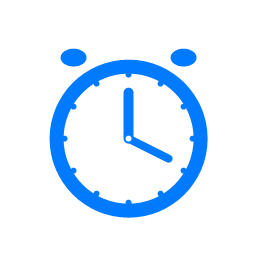
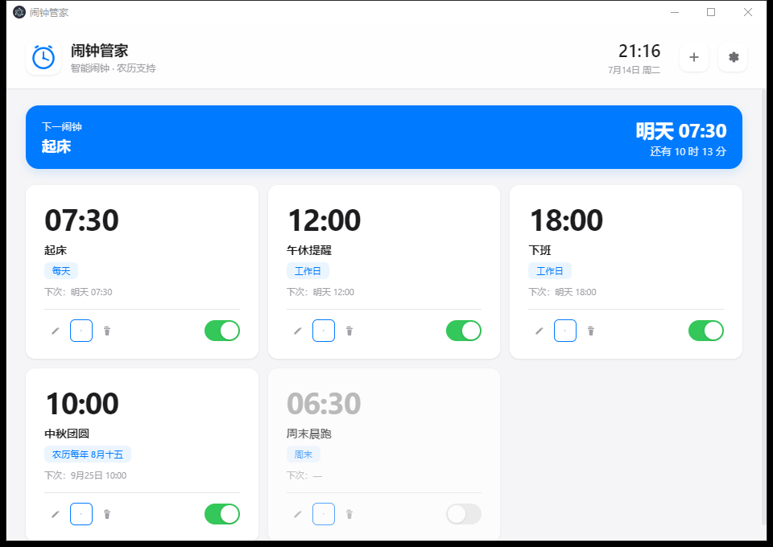

<div align="center">



# ⏰ 闹钟管家

**本地优先的多闹钟桌面管家 · 苹果白设计 · 隐私安全 · 农历支持**

<p>
  
  
  
  
  
</p>

</div>

> 用经典闹钟调度管理你的提醒与起床，配合多闹钟卡片、农历循环、5 种合成铃声、贪睡与渐强音量，让生活节奏更有序。
> **所有数据本地存储，零网络请求，零外部音频文件，隐私优先。**

<p align="center">
  
</p>

<p align="center"><sub>闹钟管家主界面 · 多闹钟卡片列表</sub></p>

---

## ✨ 核心特色

<p align="center">
  <code>📅 农历循环</code>
  <code>🎵 Web Audio 合成</code>
  <code>🔒 隐私优先</code>
  <code>😴 智能贪睡</code>
  <code>🔊 渐强音量</code>
  <code>⌨️ 全局快捷键</code>
  <code>📦 JSON 导入导出</code>
  <code>🕯️ 触发历史</code>
</p>

---

## 📦 下载安装

<table>
<tr>
<td align="center" bgcolor="#eef4fc" width="50%" style="padding:22px;border-radius:10px">
<b>🪟 Windows 便携版</b><br>
<sub>双击即可运行 · 无需安装</sub><br><br>
<sub style="color:#8b949e">🚧 Release 即将发布</sub>
</td>
<td align="center" bgcolor="#eef4fc" width="50%" style="padding:22px;border-radius:10px">
<b>🪟 Windows 安装版</b><br>
<sub>NSIS 安装包 · 支持自定义路径</sub><br><br>
<sub style="color:#8b949e">🚧 Release 即将发布</sub>
</td>
</tr>
</table>

> 临时获取方式：克隆仓库源码本地运行（见下方「快速开始」）。

---

## ✨ 功能特性

<table>
<tr>
<td width="50%" bgcolor="#f8fbff" style="padding:20px 24px;border-radius:10px">
<b>🔔 多闹钟管理</b><br>
<sub>无限闹钟 · 可视化卡片列表 · 一键启用/禁用</sub>
</td>
<td width="50%" bgcolor="#f8fbff" style="padding:20px 24px;border-radius:10px">
<b>📅 丰富重复模式</b><br>
<sub>一次性 / 每天 / 工作日 / 周末 / 自定义 / 农历每年 / 农历一次性</sub>
</td>
</tr>
<tr>
<td width="50%" bgcolor="#f8fbff" style="padding:20px 24px;border-radius:10px">
<b>🎵 5 种合成铃声</b><br>
<sub>风铃 / 钟声 / 马林巴 / 蜂鸣 / 鸟鸣 · Web Audio 实时合成</sub>
</td>
<td width="50%" bgcolor="#f8fbff" style="padding:20px 24px;border-radius:10px">
<b>😴 智能贪睡</b><br>
<sub>自定义贪睡时长 · 最大贪睡次数上限 · 防过度赖床</sub>
</td>
</tr>
<tr>
<td width="50%" bgcolor="#f8fbff" style="padding:20px 24px;border-radius:10px">
<b>🔊 渐强音量</b><br>
<sub>触发后音量从 0 渐进至最大 · 避免突然大声惊吓</sub>
</td>
<td width="50%" bgcolor="#f8fbff" style="padding:20px 24px;border-radius:10px">
<b>🔔 桌面通知</b><br>
<sub>Windows 原生通知 + 弹出全屏触发窗口</sub>
</td>
</tr>
<tr>
<td width="50%" bgcolor="#f8fbff" style="padding:20px 24px;border-radius:10px">
<b>📌 托盘常驻</b><br>
<sub>后台运行不占任务栏 · 单击托盘图标唤起</sub>
</td>
<td width="50%" bgcolor="#f8fbff" style="padding:20px 24px;border-radius:10px">
<b>⌨️ 全局快捷键</b><br>
<sub>Ctrl+Alt+A 一键唤起主窗口</sub>
</td>
</tr>
<tr>
<td width="50%" bgcolor="#f8fbff" style="padding:20px 24px;border-radius:10px">
<b>💾 本地存储</b><br>
<sub>userData/alarms.json · 原子写入 · 自动备份</sub>
</td>
<td width="50%" bgcolor="#f8fbff" style="padding:20px 24px;border-radius:10px">
<b>📦 导入导出</b><br>
<sub>JSON 备份/恢复 · 迁移无忧</sub>
</td>
</tr>
<tr>
<td width="50%" bgcolor="#f8fbff" style="padding:20px 24px;border-radius:10px">
<b>🕯️ 触发历史</b><br>
<sub>最近 200 条触发日志可查</sub>
</td>
<td width="50%" bgcolor="#f8fbff" style="padding:20px 24px;border-radius:10px">
<b>🔒 单实例锁</b><br>
<sub>防止多开冲突 · 防止数据竞争</sub>
</td>
</tr>
</table>

---

## 🚀 快速开始

### 源码运行

```bash
git clone https://github.com/grrtyre/youqu.git
cd youqu/alarm-manager
npm install
npm start
```

### 创建闹钟

1. 点击右上角 **＋** 或按 `Ctrl+N`
2. 输入标签（如「起床」「会议」「吃药」）
3. 选择时间和重复模式
4. 选择铃声（可点击「试听」预览）
5. 设置贪睡时长与最大贪睡次数
6. 保存

### 触发响铃

闹钟触发时：

<table>
<tr>
<td width="33%" bgcolor="#f8fbff" style="padding:22px 18px;border-radius:12px">
<b>🔔 系统通知</b><br>
<sub>右下角弹出原生通知</sub>
</td>
<td width="34%" bgcolor="#f8fbff" style="padding:22px 18px;border-radius:12px">
<b>🖥️ 全屏窗口</b><br>
<sub>屏幕中央弹出触发窗口</sub>
</td>
<td width="33%" bgcolor="#f8fbff" style="padding:22px 18px;border-radius:12px">
<b>🎵 渐强铃声</b><br>
<sub>按设定音量渐强循环播放</sub>
</td>
</tr>
</table>

可选择：

- **贪睡 N 分钟** —— 推后指定时间再响，次数用尽后按钮自动禁用
- **关闭闹钟** —— 立即停止铃声，按重复模式计算下次触发

### 托盘菜单

右键托盘图标可：

- 查看下一闹钟信息
- 打开主窗口
- 快速添加闹钟
- 退出应用

### 数据备份

进入 **设置 → 数据**：

- **导出 JSON** —— 保存所有闹钟与设置到本地文件
- **导入 JSON** —— 从备份文件恢复

---

## ⌨️ 快捷键

| 快捷键 | 功能 | 说明 |
|:---:|:---|:---|
| `Ctrl+Alt+A` | 全局唤起主窗口 | 任意应用下可用 |
| `Ctrl+N` | 快速添加闹钟 | 仅主窗口可用 |
| `Esc` | 关闭模态框 | 仅模态框打开时 |

---

## 🛠️ 技术栈

| 技术 | 说明 |
|:---|:---|
| **Electron 31** | 跨平台桌面应用框架 |
| **原生 JavaScript** | 零前端框架依赖 |
| **Web Audio API** | 实时合成 5 种铃声 |
| **农历算法** | 经典查表法，覆盖 1900-2100 年，含闰月支持 |
| **node:test** | 内置测试框架，无外部依赖 |

---

## 📁 项目结构

```text
alarm-manager/
├── src/
│   ├── main.js              # 主进程：窗口、托盘、调度、IPC
│   ├── preload.js           # 预加载：contextBridge 安全暴露 API
│   ├── index.html           # 主窗口界面
│   ├── styles.css           # 苹果白高端风格样式
│   ├── renderer.js          # 主窗口逻辑 + Web Audio 铃声
│   ├── trigger.html         # 触发窗口界面
│   ├── trigger.js           # 触发窗口逻辑 + 循环铃声
│   ├── alarm-engine.js      # 闹钟调度引擎（纯函数）
│   ├── lunar.js             # 农历转换模块（1900-2100）
│   ├── store.js             # 本地存储（原子写入 + 备份）
│   └── assets/
│       ├── icon.png         # 应用图标
│       └── icon.ico         # Windows 图标
├── test/
│   ├── alarm-engine.test.js # 调度引擎测试
│   ├── lunar.test.js        # 农历转换测试
│   └── store.test.js        # 存储模块测试
├── package.json
├── LICENSE
└── README.md
```

---

## 🧪 测试

```bash
npm test
```

测试覆盖：

- 闹钟调度：一次性/每天/工作日/周末/自定义/农历年度/农历一次性
- 触发判定与防重复
- 贪睡次数限制
- 农历公历往返转换（春节、中秋、闰月）
- 存储原子写入、备份、UTF-8 中文不乱码
- 日志裁剪（最多 200 条）

---

## 🔒 隐私说明

| 项目 | 说明 |
|:---|:---|
| **完全本地** | 闹钟数据、设置、日志均存储在本机 `userData/alarms.json` |
| **无网络请求** | 不联网、不上传、不统计 |
| **无第三方依赖** | 仅依赖 Electron 运行时 |
| **铃声实时合成** | 不读取任何音频文件 |

---

## 📄 License

[MIT License](./LICENSE)

---

## ☕ 支持我们

如果这个工具帮到了你，欢迎在爱发电请我们喝杯咖啡：

👉 [https://www.ifdian.net/a/giquwei](https://www.ifdian.net/a/giquwei)

你的支持是我们持续做下去的动力。

---

## 🙏 鸣谢

感谢以下朋友的支持（按支持时间排序）：

<!-- 鸣谢名单占位：有了支持者后在这里添加，格式：- [@用户名](主页链接) -->

_暂无，期待第一个支持者的出现。_

---

## 📝 更新日志

### v1.0.0

- 首次发布
- 多闹钟管理 + 7 种重复模式（含农历年度/一次性）
- 5 种 Web Audio 合成铃声
- 渐强音量 + 贪睡次数上限
- 系统托盘 + 全局快捷键 + 单实例锁
- JSON 导入导出 + 自动备份
- 苹果白高端风格 UI

---

<div align="center">
  <sub>Made with ☕ & 💙 · 闹钟管家 © 2026 · MIT License</sub>
</div>
