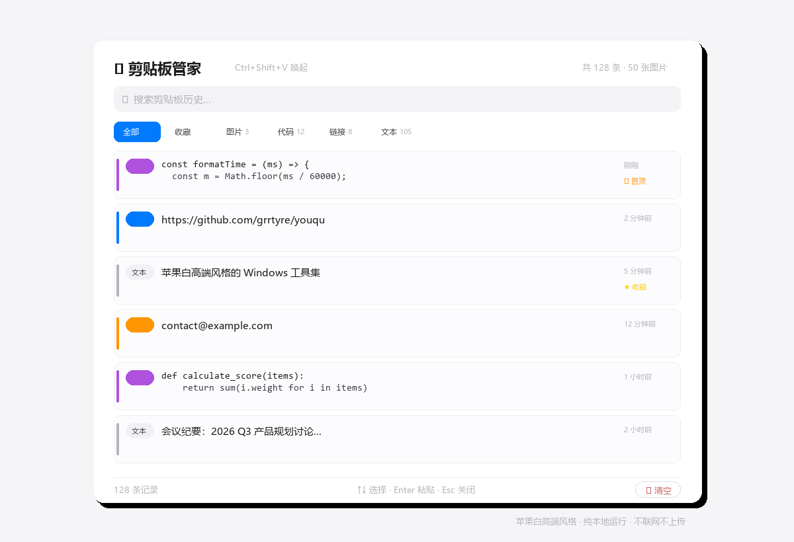

<div align="center">


<h1>📋 剪贴板管家 · Clipboard Manager</h1>

<p><b>苹果白高端风格的 Windows 剪贴板历史管理器</b></p>

<p>自动记录 · 智能分类 · 全局快捷键 · 键盘导航 · 一键粘贴 · 纯本地隐私</p>

<p>


</p>

</div>

<br>

> Windows 上最美、最快、最隐私的剪贴板历史管理器。自动记录你复制的一切，全局快捷键秒级唤起，智能分类代码/链接/邮箱/电话/文本/图片，键盘导航一键粘贴到前台窗口。苹果白高端风格，纯本地运行，不联网、不上传、不登录。

---

## ⬇️ 直接下载

> 不想自己打包？直接下载下方 exe 即可使用，无需安装 Node.js 或任何依赖。

| 版本 | 下载链接 | 说明 |
|---|---|---|
| 安装版（推荐） | [剪贴板管家 Setup 1.3.0.exe](https://github.com/grrtyre/youqu/releases/download/clipboard-manager-v1.3.0/Setup.1.3.0.exe) | 双击安装，自动创建桌面快捷方式 |
| 免安装便携版 | [剪贴板管家 1.3.0.exe](https://github.com/grrtyre/youqu/releases/download/clipboard-manager-v1.3.0/1.3.0.exe) | 双击即用，不写注册表 |

系统要求：Windows 10/11 x64 · 前往 [Releases 页面](../../releases) 查看所有版本

## 🖼 效果展示

<div align="center">



</div>

自动记录所有剪贴板内容（文本+图片），智能分类标注，键盘导航秒级粘贴，搜索高亮，置顶收藏常用片段。

## ✨ 功能特性

### 🎯 核心体验

- **📋 自动记录** —— 后台静默运行，自动捕获所有剪贴板内容（文本 + 图片），去重存储
- **🖼 图片剪贴板** —— 复制的图片自动保存为 PNG，列表显示缩略图，点击复制回剪贴板（最多 50 张）
- **⌨️ 全局快捷键** —— `Ctrl + Shift + V` 唤起/隐藏面板，在屏幕右下角弹出
- **🔑 键盘导航** —— `↑ ↓` 选择条目，`Enter` 复制并自动粘贴到前台窗口，`Esc` 关闭
- **📌 一键粘贴到前台** —— 选中条目后自动复制并模拟 `Ctrl+V` 粘贴到上一个前台窗口（可在设置中关闭）

### 🧠 智能分类与搜索

- **🏷 智能分类** —— 自动识别代码、链接、邮箱、手机号、纯文本、图片，浅色 pill 标签标记
- **🔍 即时搜索** —— 实时搜索历史内容，匹配关键词高亮，按类型筛选（全部/收藏/图片/代码/链接/文本）
- **👁 内容预览** —— 点击 👁 按钮内联展开完整内容：代码带行号、链接附打开按钮、图片显示大图
- **✎ 条目编辑** —— 文本类条目支持编辑（✎ 按钮），编辑后自动重新分类

### 💾 数据管理

- **📌 置顶与收藏** —— 常用片段（邮箱、地址、代码）可置顶或收藏
- **📊 容量管理** —— 最多 500 条文本 + 50 张图片，自动淘汰旧记录，保留置顶与收藏

### 🔒 隐私与系统

- **🔒 纯本地隐私** —— 数据全部本地存储（JSON + PNG 文件），不联网、不上传、不登录
- **☕ 系统托盘** —— 后台常驻，关闭窗口不退出，托盘右键退出
- **🔒 单实例锁** —— 防止多开冲突
- **🎨 苹果白高端风格** —— 参考 macOS/iOS 原生设计，白底浅灰、细腻多层阴影、蓝色 `#007aff` 强调

## 🚀 快速开始

### 方式一：直接下载安装

1. 下载上方安装包或便携版
2. 安装/解压后运行「剪贴板管家」
3. 系统托盘出现剪贴板图标，应用已在后台运行
4. 任意时刻按 `Ctrl + Shift + V` 唤起面板
5. `↑ ↓` 选择条目，`Enter` 一键粘贴到前台窗口

### 方式二：源码运行

```bash
cd clipboard-manager
npm install
npm start              # 启动应用
npm test               # 运行核心逻辑测试
npm run dist           # 打包 Windows exe（需 electron-builder）
```

## ⌨️ 快捷键

| 快捷键 | 功能 |
|---|---|
| `Ctrl + Shift + V` | 唤起/隐藏剪贴板面板 |
| `↑` / `↓` | 在历史条目间上下移动高亮 |
| `Enter` | 复制当前高亮条目并自动粘贴到前台窗口 |
| `空格` | 展开/收起当前高亮条目的内容预览面板 |
| `Esc` | 收起预览 / 关闭面板 |
| 点击卡片 | 复制该条内容并隐藏面板 |
| `👁` 按钮 | 展开/收起该条内容预览 |
| `★` 按钮 | 收藏/取消收藏 |
| `📌` 按钮 | 置顶/取消置顶 |
| `🗑` 按钮 | 删除该条 |
| `✎` 按钮 | 编辑该条内容（仅文本类，Ctrl+Enter 保存 / Esc 取消） |

## 📁 项目结构

```
clipboard-manager/
├── src/
│   ├── main.js              # Electron 主进程（剪贴板监听、快捷键、托盘、IPC、粘贴到前台）
│   ├── preload.js           # 安全 IPC 桥
│   └── renderer/
│       ├── index.html       # 界面
│       ├── styles.css       # 苹果白高端风格样式
│       └── renderer.js      # 渲染进程逻辑（列表、搜索、键盘导航、自动粘贴开关）
├── build/
│   ├── icon.ico             # 应用图标（多尺寸）
│   └── icon-source.png      # 图标源文件
├── test/
│   └── test.js              # 核心逻辑测试
├── package.json
└── README.md
```

## 🛠 技术栈

- **Electron 28** —— 跨平台桌面框架
- **纯 JavaScript** —— 无框架依赖，原生 HTML/CSS/JS
- **electron-builder** —— 打包成 Windows 安装包/便携版
- **苹果白设计系统** —— 浅色背景、细腻阴影、系统字体、#007AFF 强调色

## 🧪 测试

```bash
npm test
```

79 个用例覆盖：内容分类、去重、最大条目限制、清空保留置顶与收藏、搜索过滤、相对时间、键盘导航索引边界、自动粘贴设置、数据结构契约、搜索关键词高亮（转义/大小写/多匹配/正则元字符安全）、预览展开切换逻辑、字符与行数统计、图片指纹与去重、图片条目结构、缩略图尺寸计算、编辑条目逻辑、图片条目数量上限。

## 🎨 设计哲学

- **苹果白高端风格** —— 参考 macOS / iOS 原生设计
- **#007AFF 系统蓝** —— 唯一强调色，贯穿按钮/链接/选中态
- **隐私第一** —— 你的剪贴板包含敏感信息，绝不上传
- **极简极速** —— 秒开，不打扰，用完即走
- **键盘友好** —— 全局快捷键唤起 + 上下箭头 + Enter 粘贴，纯键盘完成整个工作流
- **智能不臃肿** —— 自动分类但不做过度推断，保持工具属性

## 📝 更新日志

### v1.3.0（2026-07-05）
- 🖼 **新增图片剪贴板支持**：自动记录复制的图片，列表显示缩略图，点击复制回剪贴板，最多保留 50 张
- ✎ **新增条目编辑功能**：文本类条目支持编辑（✎ 按钮），编辑后自动重新分类，Ctrl+Enter 保存 / Esc 取消
- 🐛 **修复清空 bug**：清空操作现在保留置顶和收藏项（之前只保留置顶）
- 🔍 **筛选 tabs 新增「图片」分类**：快速筛选图片条目
- 🎨 **优化底部状态栏**：三列网格布局（记录数 / 快捷键提示 / 清空按钮），层次更清晰
- 🎨 **优化空状态视觉**：更大的图标、更精细的文案层级
- 🧪 **单元测试增至 79 个**

### v1.2.0
- 全局快捷键、键盘导航、自动粘贴到前台窗口
- 内容预览面板（代码带行号、链接打开按钮）
- 搜索关键词高亮
- 系统托盘、单实例锁

### v1.1.0
- 首次发布：自动记录、智能分类、置顶收藏、隐私本地存储

## ☕ 支持我们

如果这个工具帮到了你，欢迎在爱发电请我们喝杯咖啡：

👉 [https://www.ifdian.net/a/giquwei](https://www.ifdian.net/a/giquwei)

你的支持是我们持续做下去的动力。

## 🙏 鸣谢

感谢以下朋友的支持（按支持时间排序）：

<!-- 鸣谢名单占位：有了支持者后在这里添加，格式：- [@用户名](主页链接) -->

_暂无，期待第一个支持者的出现。_

## 📄 License

[MIT](./LICENSE) —— 可自由使用、修改、分发。
