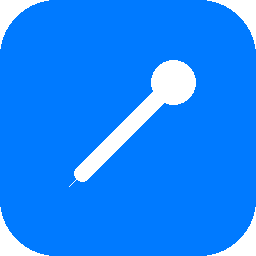
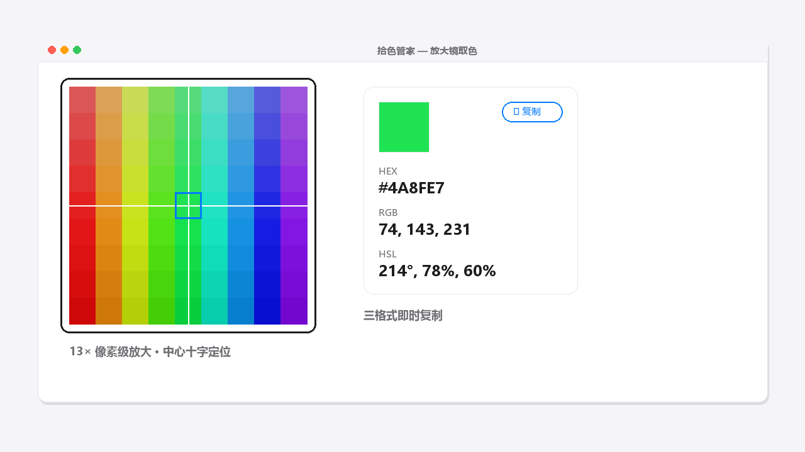
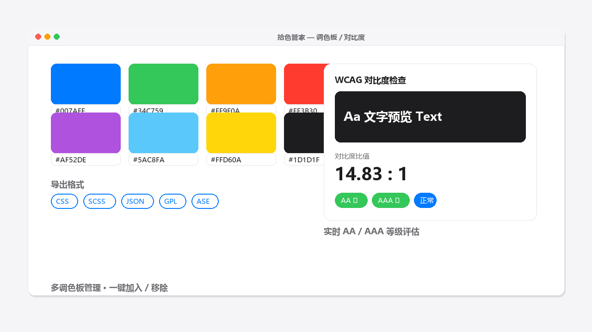
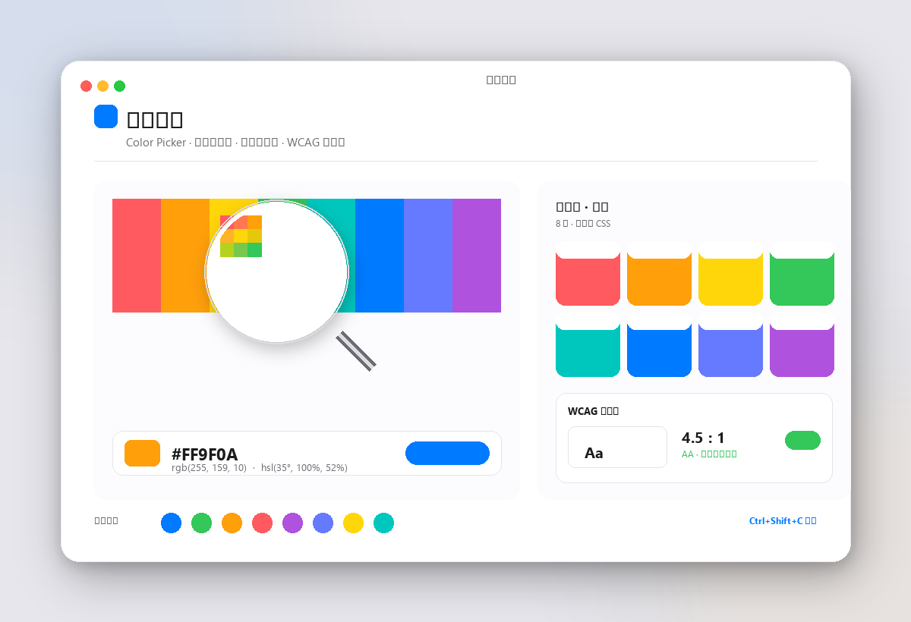

<div align="center">



# 🎨 拾色管家 · Color Picker

**苹果白高端风格的 Windows 屏幕取色器与调色板管理工具**

像素级放大取色 · 多格式一键复制 · 多调色板管理 · WCAG 对比度检查 · 多格式导出

[](https://github.com/grrtyre/youqu/releases/tag/color-picker-v1.1.0)
[](https://github.com/grrtyre/youqu/tree/main/color-picker)
[](./LICENSE)
[](#-测试)

</div>

<br>

> 系统托盘常驻，全局快捷键唤起，放大镜精准取色，多格式一键复制，调色板本地管理，内置 WCAG 对比度检查器与多格式导出。**所有数据存本地，无网络、无上传、无追踪。**

---

## 📊 亮点速览

| 核心取色 | 调色板 | 可访问性 | 隐私 |
|:---:|:---:|:---:|:---:|
| 13× 像素放大 | 多调色板管理 | WCAG 对比度 | 0 网络请求 |
| 3 格式复制 | 5 格式导出 | AA / AAA 等级 | 0 上传追踪 |
| 50 条历史 | 一键加入移除 | 实时预览 | 0 账号登录 |
| 全局快捷键 | 本地持久化 | 前景背景切换 | 单文件便携 |

<br>

## 📑 目录

- [直接下载](#️-直接下载)
- [效果展示](#-效果展示)
- [功能特性](#-功能特性)
- [快速开始](#-快速开始)
- [快捷键](#️-快捷键)
- [使用场景](#-使用场景)
- [对比其他工具](#-对比其他工具)
- [技术栈](#-技术栈)
- [项目结构](#-项目结构)
- [测试](#-测试)
- [设计哲学](#-设计哲学)
- [常见问题](#-常见问题)
- [更新日志](#-更新日志)
- [支持我们](#-支持我们)

---

## ⬇️ 直接下载

> 不想自己打包？直接下载下方 exe 即可使用，无需安装 Node.js 或任何依赖。

| 版本 | 下载链接 | 体积 | 说明 |
|:---|:---|:---:|:---|
| 🟦 **安装版（推荐）** | [拾色管家 Setup 1.1.0.exe](https://github.com/grrtyre/youqu/releases/download/color-picker-v1.1.0/拾色管家.Setup.1.1.0.exe) | ~85 MB | v1.1.0 安装版，含开始菜单快捷方式，自动注册 |
| 🟪 **免安装便携版** | [拾色管家 Portable 1.1.0.exe](https://github.com/grrtyre/youqu/releases/download/color-picker-v1.1.0/拾色管家.Portable.1.1.0.exe) | ~85 MB | v1.1.0 免安装便携版，双击即用，U 盘可携 |

**系统要求：** Windows 10/11 x64  ·  前往 [Releases 页面](../../releases) 查看所有版本

---

## 🖼 效果展示

<div align="center">



**🔍 放大镜取色** —— 13× 像素级放大 · 中心十字定位 · HEX / RGB / HSL 三格式即时复制

<br>



**🎨 调色板 + WCAG 对比度** —— 多调色板管理 · 5 格式导出 · 实时 AA / AAA 等级评估

<br>



**完整主界面** —— 取色 · 历史 · 调色板 · 对比度 · 设置

</div>

---

## ✨ 功能特性

### 🔍 取色核心
- **🖱 全局快捷键取色** —— `Ctrl+Shift+C` 随时唤起，无需切窗口（v1.1 支持自定义）
- **🔍 放大镜精准对焦** —— 13× 像素级放大，中心十字定位，所见即所得
- **📋 多格式一键复制** —— HEX / RGB / HSL 三种格式，点击即复制
- **🕐 历史拾取记录** —— 自动去重，最新置顶，最多保留 50 条
- **⌨️ 键盘友好** —— `Esc` 取消、点击确认、右键也可取消

### 🎨 调色板管理
- **🗂 多调色板管理** —— 新建 / 重命名 / 删除调色板，颜色一键加入 / 移除
- **📦 多格式导出** —— 一键导出 **CSS** / **SCSS** / **JSON** / **GPL (GIMP)** / **ASE (Adobe)**，设计师与前端无缝衔接
- **💾 本地持久化** —— 所有调色板与历史存于本地，关闭重开不丢失

### ⚖️ WCAG 可访问性
- **📊 实时对比度计算** —— 前景 / 背景对比度比值，附预览色块
- **🏷 AA / AAA 等级评估** —— 自动判定是否符合 WCAG 2.1 可访问性标准
- **👁 预览渲染** —— 文字在背景色上的实际显示效果即时呈现

### ⚙️ 系统集成
- **⌨️ 快捷键自定义** —— 设置面板录制新组合键，托盘菜单与界面标签同步更新
- **☕ 托盘常驻** —— 关闭窗口不退出，后台待命，点击托盘快速唤起
- **🔒 纯本地隐私** —— 无网络、无上传、无追踪、无账号

---

## 🚀 快速开始

### 方式一：直接下载安装（推荐）

1. 下载上方安装包或便携版
2. 安装 / 解压后运行「拾色管家」
3. 系统托盘出现蓝色吸管图标，应用已在后台运行
4. 任意时刻按 `Ctrl+Shift+C` 进入取色模式
5. 鼠标移动到目标位置，点击即取色；按 `Esc` 取消

### 方式二：源码运行

```bash
cd color-picker
npm install
npm start              # 启动应用
npm test               # 运行核心逻辑测试（67 项）
npm run build          # 打包 Windows exe（需 electron-builder，建议配置镜像加速）
```

> 💡 **首次使用提示**：取色模式下，移动鼠标即可实时预览放大镜中的像素颜色，找到目标色后**点击鼠标左键**确认并复制到剪贴板。

---

## ⌨️ 快捷键

| 快捷键 | 场景 | 功能 |
|:---|:---|:---|
| `Ctrl + Shift + C` | 任意位置 | 全局唤起取色模式（v1.1 起支持自定义） |
| 鼠标移动 | 取色模式中 | 实时预览放大镜中的像素颜色 |
| 鼠标左键 | 取色模式中 | 确认取色并复制到剪贴板 |
| `Esc` / 鼠标右键 | 取色模式中 | 取消取色 |
| 点击托盘图标 | 主界面隐藏时 | 唤起主界面（历史 / 调色板 / 对比度 / 设置） |
| 点击颜色卡片 | 主界面中 | 复制对应格式（HEX / RGB / HSL） |

---

## 🎯 使用场景

| 场景 | 说明 |
|:---|:---|
| 🎨 **设计师取色** | 从任意网页、图片、软件界面拾取颜色，建立自己的色卡 |
| 💻 **前端开发** | 还原设计稿配色，复制 HEX 直接用，导出 CSS 变量 |
| 📊 **PPT / 文档配色** | 抓取品牌色，保持视觉一致性 |
| ♿ **可访问性审查** | 用 WCAG 对比度检查器验证文字与背景对比是否达标 |
| 💡 **配色灵感收集** | 看到好看的配色随手保存到调色板，导出 SCSS 给工程用 |

---

## 🆚 对比其他工具

| 能力 | 拾色管家 | Windows 自带 | QQ 截图取色 | 在线取色网站 |
|:---|:---:|:---:|:---:|:---:|
| 像素级放大镜 | ✅ 13× | ❌ | ⚠️ 有限 | ❌ |
| 多格式复制 | ✅ HEX/RGB/HSL | ⚠️ 仅 HEX | ⚠️ 仅 HEX | ⚠️ 需手动 |
| 调色板管理 | ✅ 多板 | ❌ | ❌ | ❌ |
| 多格式导出 | ✅ 5 种 | ❌ | ❌ | ❌ |
| WCAG 对比度 | ✅ 内置 | ❌ | ❌ | ⚠️ 需另开站 |
| 历史记录 | ✅ 50 条 | ❌ | ❌ | ❌ |
| 离线可用 | ✅ 纯本地 | ✅ | ✅ | ❌ |
| 托盘常驻 | ✅ | ❌ | ❌ | ❌ |
| 隐私无上传 | ✅ | ✅ | ⚠️ | ❌ |

---

## 🛠 技术栈

- **Electron 28** —— 跨平台桌面应用框架
- **原生 JavaScript** —— 无框架依赖，纯净轻量
- **desktopCapturer** —— 屏幕截图与像素采样
- **Canvas 2D** —— 放大镜实时渲染
- **IPC + contextBridge** —— 主进程 / 渲染进程安全通信
- **苹果白设计系统** —— 浅色背景、细腻阴影、系统字体、#007AFF 强调色

---

## 📁 项目结构

```
color-picker/
├── src/
│   ├── main.js              # 主进程：窗口、托盘、全局快捷键、取色、导出 IPC
│   ├── preload.js           # 预加载：contextBridge 安全 API
│   ├── core/
│   │   ├── color-utils.js   # 颜色转换 + 像素采样 + WCAG 对比度
│   │   ├── storage.js       # 调色板与历史本地持久化 + 快捷键校验
│   │   └── palette-export.js # 调色板导出（CSS/SCSS/JSON/GPL/ASE）
│   └── renderer/
│       ├── index.html       # 主界面（取色 / 历史 / 对比度 / 调色板 / 设置）
│       ├── styles.css       # 苹果白风格样式
│       ├── renderer.js      # 主界面逻辑（含对比度检查器、设置弹层）
│       ├── picker.html      # 取色覆盖层
│       ├── picker.css       # 放大镜样式
│       └── picker.js        # 取色逻辑
├── test/
│   └── test.js              # 67 个单元测试
├── build/
│   ├── icon.ico             # 应用图标（多尺寸）
│   └── make_icon.py         # 图标生成脚本
├── assets/                  # 截图与展示素材
├── .gitignore
├── LICENSE
├── package.json
└── README.md
```

---

## 🧪 测试

```bash
npm test
```

覆盖 **67 项测试**：颜色转换互逆性、边界值、非法输入、像素采样、WCAG 对比度（黑白比值、相对亮度、等级评估）、调色板导出（CSS/SCSS/JSON/GPL/ASE 二进制头与块结构）、快捷键校验（合法 / 非法 / 边界）、存储往返、调色板增删改。

---

## 🎨 设计哲学

- **苹果白高端风格** —— 参考 macOS / iOS 原生设计
- **#007AFF 系统蓝** —— 唯一强调色，贯穿按钮 / 链接 / 选中态
- **细腻阴影分层** —— 卡片轻浮于背景，色块轻浮于卡片
- **pill 描边按钮** —— 次要操作统一 pill 描边样式
- **零干扰** —— 无原生菜单栏，沉浸式工作

---

## ❓ 常见问题

<details>
<summary><b>取色时放大镜不显示 / 取不到色？</b></summary>

请确认：① 应用在托盘运行中（托盘有蓝色吸管图标）；② 按下 `Ctrl+Shift+C` 后屏幕中央出现放大镜；③ 如使用多屏，请在主屏取色；④ 如系统拦截全局快捷键，请在设置中录制新的组合键。
</details>

<details>
<summary><b>数据存在哪里？能迁移吗？</b></summary>

所有调色板与历史记录存于用户目录下的本地配置文件（`%APPDATA%/拾色管家/`），纯 JSON 格式，复制该目录即可完整迁移到新设备，无需登录账号。
</details>

<details>
<summary><b>ASE / GPL 导出能在哪些软件用？</b></summary>

**ASE** 可直接导入 Adobe Photoshop / Illustrator；**GPL** 可导入 GIMP 调色板面板；**CSS / SCSS** 可直接粘贴到前端工程；**JSON** 便于程序化处理或自定义工具消费。
</details>

<details>
<summary><b>会联网或上传我的数据吗？</b></summary>

不会。应用**纯本地运行，0 网络请求、0 上传、0 追踪**，不内置任何统计 SDK 与升级检查。版本更新需手动到 Releases 页面下载。
</details>

<details>
<summary><b>便携版和安装版有什么区别？</b></summary>

功能完全一致。安装版会写入开始菜单快捷方式并注册卸载项；便携版为单文件 EXE，双击即用，适合放 U 盘随身携带，不在系统留注册项。
</details>

---

## 📜 更新日志

### v1.1.0 <sub>`2026-07-05`</sub>

**🚀 新功能**
- 📦 调色板多格式导出：CSS 变量 / SCSS 变量 / JSON / GPL (GIMP) / ASE (Adobe Swatch Exchange 二进制)
- ⚖️ WCAG 2.1 对比度检查器：实时前景 / 背景对比度比值 + AA / AAA 等级评估 + 预览
- ⚙️ 快捷键自定义：设置弹层录制新组合键，托盘菜单与界面标签同步更新

**🐛 交付质量**
- 修复 NSIS 安装包文件名英文不一致问题：`ColorPicker-Setup-1.0.0.exe` → `拾色管家 Setup 1.1.0.exe`
- README 下载链接统一为中文文件名

**🎨 UI 细化**
- 对比度徽标采用描边 pill 风格（柔和浅底 + 描边）
- ratio-box 渐变底色 + 内阴影，数字字号增至 36px
- 加深 modal 阴影至 `0 8px 32px rgba(0,0,0,0.12)`
- 调色板导出按钮组独立虚线框行，与加入按钮分离

**🧪 测试**
- 单元测试从 32 项扩展到 **67 项**，新增覆盖 WCAG 对比度、调色板导出、快捷键校验

### v1.0.0 <sub>`初始版本`</sub>
- 全局快捷键取色、放大镜、多格式复制、历史记录、多调色板管理、托盘常驻、纯本地隐私

---

## ☕ 支持我们

如果这个工具帮到了你，欢迎在爱发电请我们喝杯咖啡：

👉 [https://www.ifdian.net/a/giquwei](https://www.ifdian.net/a/giquwei)

你的支持是我们持续做下去的动力。

## 🙏 鸣谢

感谢以下朋友的支持（按支持时间排序）：

<!-- 鸣谢名单占位：有了支持者后在这里添加，格式：- [@用户名](主页链接) -->

_暂无，期待第一个支持者的出现。_

---

## 📄 License

[MIT License](./LICENSE) —— 可自由使用、修改、分发。

<div align="center">
<sub>🎨 拾色管家 · 用苹果白设计，做贴心的取色工具</sub>
</div>
