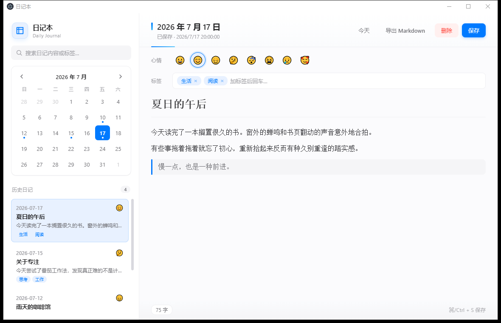

<div align="center">


# 📔 日记本 · Daily Journal

**一款极简、克制的桌面日记应用**

<i>苹果白风格 · 本地存储 · 心情追踪 · 全文搜索 · Markdown 导出</i>

<p>
  
  
  
  
  
  
</p>

</div>

> 📝 记录每天值得记住的事，不为社交，只为自己的内心。<br>
> 衬线字体 · 舒适行距 · 苹果白设计，让记录变成享受。

---

## ✨ 特性亮点

<div align="center">

🤍 **极简克制** &nbsp;·&nbsp; 🔒 **隐私至上** &nbsp;·&nbsp; 📅 **日历回望** &nbsp;·&nbsp; 🎭 **心情轨迹** &nbsp;·&nbsp; 🎯 **专注写作** &nbsp;·&nbsp; ⚡ **秒级启动**

</div>

---

## 🖼️ 效果展示

<p align="center">
  
</p>

<div align="center">

<i>日历回望 · 沉浸写作 · 心情追踪 —— 一切只为记录本身</i>

</div>

---

## 📋 功能特性

| | 能力 | 说明 |
|:---:|---|---|
| 📅 | 日历视图 | 月历高亮显示写过日记的日子，点选即跳转 |
| ✍️ | 沉浸写作 | 系统衬线字体 + 舒适行距，专注记录本身 |
| 🎭 | 心情追踪 | 用 emoji 给每天打情绪标签，回看情绪轨迹 |
| 🏷️ | 标签管理 | 给日记打标签，按标签筛选与检索 |
| 🔍 | 全文搜索 | 关键词、标签、日期皆可搜索，结果即时呈现 |
| 💾 | 本地存储 | 数据仅存在本机，绝不上传，完全离线可用 |
| 📤 | Markdown 导出 | 某天日记一键导出为 `.md` 文件 |
| 🤍 | 苹果白风格 | 白色背景、细腻阴影、系统字体、`#007aff` 蓝色点缀 |

---

## ⬇️ 下载与使用

| 方式 | 链接 | 说明 |
|---|---|---|
| 📦 Windows 安装版 | [日记本-1.0.0-setup.exe](https://github.com/grrtyre/youqu/releases/download/diary-manager-v1.0.0/%E6%97%A5%E8%AE%B0%E6%9C%AC-1.0.0-setup.exe) | NSIS 安装程序，支持自定义安装路径 |
| 🛠️ 源码运行 | [youqu/diary-manager](./) | 克隆仓库后本地启动，约 2 分钟即可使用 |
| 📋 历史版本 | [Releases](../../releases) | 查看所有已发布版本 |

> 💡 若安装包暂未准备好，可使用「源码运行」方式，同样简单快捷。

---

## 🚀 快速开始

### 方式一：直接使用（推荐）

下载上方的安装包，双击安装即可。

### 方式二：从源码运行

```bash
# 克隆仓库
git clone https://github.com/grrtyre/youqu.git
cd youqu/diary-manager

# 安装依赖（国内建议使用镜像加速）
npm config set registry https://registry.npmmirror.com
npm install

# 启动应用
npm start
```

### 构建安装包

```bash
npm run build
```

构建产物位于 `dist/` 目录。

---

## ⌨️ 快捷键

| 快捷键 | 功能 | 说明 |
|:---:|---|---|
| `Ctrl` / `⌘` + `S` | 保存日记 | 自动保存，也可手动触发 |
| `Enter` | 确认添加标签 | 标签输入框中按回车确认 |
| `,` | 添加标签 | 快捷分隔多个标签 |
| `Backspace` | 删除标签 | 标签输入为空时删除最后一个 |

> 💡 macOS 用户请使用 `⌘` 替代 `Ctrl`。

---

## 📁 项目结构

```
diary-manager/
├── src/
│   ├── main.js          # 主进程：窗口、IPC、文件读写
│   ├── preload.js       # 预加载脚本：安全 API 桥
│   ├── index.html       # 主界面结构
│   ├── renderer.js      # 渲染进程：UI 逻辑
│   └── styles.css       # 苹果白风格样式
├── test/
│   └── test.js          # 核心函数单元测试
├── assets/              # 图标等资源（Logo / 多尺寸 PNG / ICO）
├── preview.png          # 效果展示截图
├── package.json
├── LICENSE
└── README.md
```

---

## 🔒 隐私说明

- 📂 所有日记数据仅保存在本地（系统 `userData/diary-data/` 目录）
- 🚫 不联网、不上传、不分析、不追踪
- ✅ 完全离线可用，断网也能正常使用

---

## 🛠️ 技术栈

<p>
  
  
  
  
  
</p>

- **Electron 31** — 跨平台桌面应用框架
- **原生 HTML/CSS/JS** — 不依赖前端框架，轻量高效
- **contenteditable** — 富文本编辑
- **JSON 文件存储** — 按日期一个文件，简单可靠
- **苹果白高端风格** — 参考 macOS/iOS 原生设计语言

---

## 💻 开发

```bash
# 安装依赖
npm install

# 运行测试
npm test

# 启动开发
npm start

# 打包构建
npm run build
```

---

## 📝 更新日志

<table><tr><td>

**`v1.0.0`** — 2026-07-17

- 🎉 **首个正式版本发布**
- ✨ 日历视图、日记编辑、心情追踪、标签管理
- 🔍 全文搜索（关键词 / 标签 / 日期）
- 📤 Markdown 导出
- 🤍 苹果白高端风格 UI

</td></tr></table>

<sub>完整更新历史请见 [Releases](../../releases)。</sub>

---

## ❓ 常见问题

<details>
<summary><b>💬 数据存在哪里？换电脑怎么办？</b></summary>

日记数据保存在系统 `userData/diary-data/` 目录（Windows 下通常在 `%APPDATA%/日记本/diary-data/`）。

- **备份**：复制整个 `diary-data` 文件夹即可
- **迁移**：把 `diary-data` 文件夹复制到新电脑的相同位置
- **数据格式**：每天一个 JSON 文件（如 `2026-07-17.json`），纯文本可读

</details>

<details>
<summary><b>💬 支持 Markdown 语法吗？</b></summary>

支持基础富文本编辑（加粗、斜体、列表等）。每篇日记可一键导出为标准 `.md` 文件，方便用其他 Markdown 编辑器打开。

</details>

<details>
<summary><b>💬 会不会联网上传我的日记？</b></summary>

**绝对不会。** 应用完全离线运行，零网络请求，不内置任何统计/追踪代码。你可以在防火墙中阻止它联网，功能完全不受影响。

</details>

<details>
<summary><b>💬 支持哪些系统？</b></summary>

基于 Electron 构建，理论支持 Windows 10/11、macOS、Linux。当前发布包针对 Windows 优化，其他系统可从源码运行。

</details>

---

## ☕ 支持我们

如果这个应用对你有帮助，欢迎请我们喝杯咖啡 —— 你的支持是我们持续做下去的动力。

<div align="center">

[](https://www.ifdian.net/a/giquwei)
[](https://github.com/grrtyre/youqu)
[](https://github.com/grrtyre/youqu)
[](../../issues)

</div>

| 方式 | 链接 | 说明 |
|:---:|:---:|---|
| 💰 爱发电 | [前往支持](https://www.ifdian.net/a/giquwei) | 任意金额，感谢每一份心意 |
| ⭐ GitHub Star | [给项目点 Star](https://github.com/grrtyre/youqu) | 让更多人看到 |
| 🔄 分享转发 | 推荐给朋友 | 口碑是最好的传播 |
| 🐛 问题反馈 | [提 Issue](../../issues) | 帮助我们改进 |

---

## 🙏 鸣谢

感谢以下朋友的支持（按支持时间排序）：

<!-- 鸣谢名单占位：有了支持者后在这里添加，格式：- [@用户名](主页链接) -->

_欢迎成为第一位支持者，你的名字将出现在这里。_

---

## 📄 License

[MIT License](./LICENSE) —— 可自由使用、修改、分发。如需商用请保留 License 文件中的版权声明。

---

## 🔗 相关项目

<div align="center">

📕 日记本是 [**youqu 工具集**](https://github.com/grrtyre/youqu) 的一员 —— 一套苹果白风格的实用桌面小工具集合。

[](https://github.com/grrtyre/youqu)

</div>

| 相关项目 | 简介 |
|---|---|
| 🍅 [番茄管家](../pomodoro-manager) | 本地优先的番茄工作法工具 |
| ⏰ [闹钟管家](../alarm-manager) | 多闹钟桌面管家 · 农历支持 |
| 📋 [剪贴板管家](../clipboard-manager) | 苹果白风格剪贴板历史管理器 |
| 🤍 [更多工具](https://github.com/grrtyre/youqu) | 访问主仓库查看全部 70+ 工具 |

<br>

<div align="center">


<sub>日记本 · Daily Journal · 用 ❤️ 与苹果白高端风格打造</sub>

<br>

<sub>⭐ 如果这个项目对你有启发，欢迎 [Star 支持](https://github.com/grrtyre/youqu) · 持续迭代中</sub>

</div>

<hr>

<div align="center">

<sub>Copyright © 2026 [youqu 工具集](https://github.com/grrtyre/youqu) · MIT License</sub>

</div>
