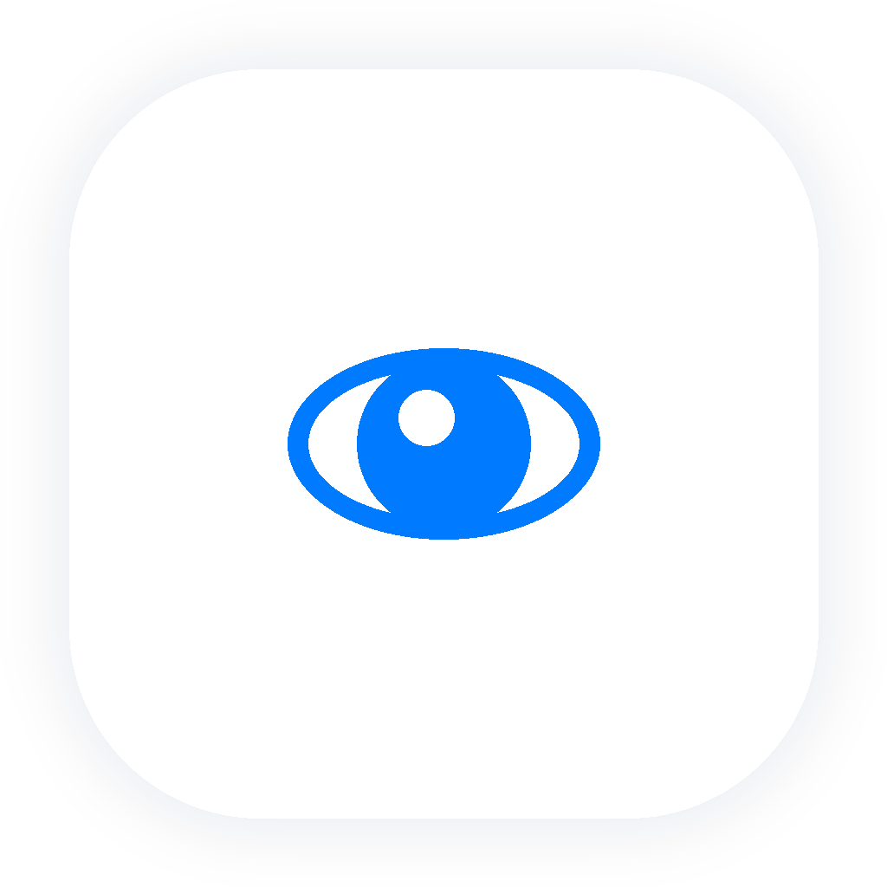
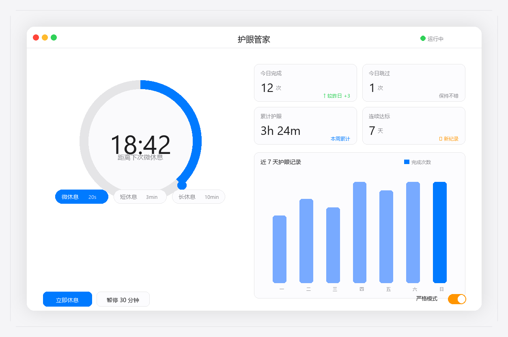
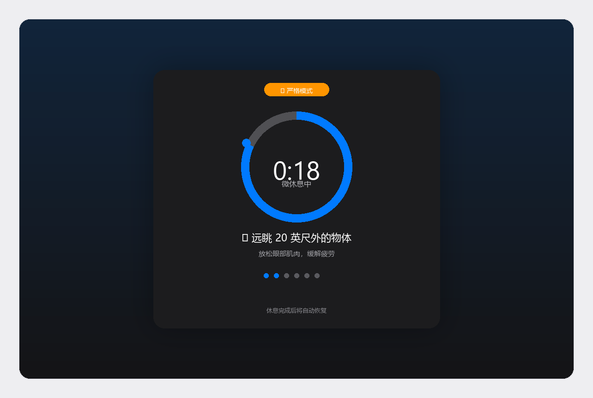

<div align="center">



# 👁 护眼管家

**Windows 上优雅的护眼休息提醒桌面管家**

> 基于 20-20-20 法则，定时提醒休息、引导眼保健操、本地统计追踪 —— 让你的眼睛在长时间用屏中保持舒适。

<br/><br/>

<!-- 核心信息徽章 -->
&nbsp;&nbsp;
&nbsp;&nbsp;


<br/><br/>

<!-- 技术栈徽章 -->
&nbsp;&nbsp;
&nbsp;&nbsp;


</div>

---

## 📑 目录

- [✨ 功能特性](#-功能特性)
- [📸 效果展示](#-效果展示)
- [⬇️ 下载安装](#️-下载安装)
- [🚀 快速开始](#-快速开始)
- [⌨️ 快捷键](#️-快捷键)
- [🛠 技术栈](#-技术栈)
- [📁 项目结构](#-项目结构)
- [🧪 测试](#-测试)
- [📝 更新日志](#-更新日志)
- [☕ 支持我们](#-支持我们)
- [🙏 鸣谢](#-鸣谢)
- [📄 License](#-license)

## ✨ 功能特性

| 模块 | 说明 |
|:---|:---|
| 🎯 **20-20-20 法则** | 每使用电脑 20 分钟，看 20 英尺（约 6 米）外的物体 20 秒，科学缓解眼疲劳 |
| ⏰ **三级休息周期** | 微休息（20秒）/ 短休息（3分钟）/ 长休息（10分钟），间隔与时长均可自定义 |
| 👁 **眼保健操引导** | 6 种护眼动作（眨眼、远眺、旋转、捂眼、焦点切换、喝水），休息时引导完成 |
| 🖥 **休息覆盖层** | 全屏休息引导界面，圆环倒计时 + 动作演示 + 进度指示，沉浸式放松 |
| 📊 **本地统计** | 今日完成/跳过次数、累计护眼时长、连续达标天数、近 7 天柱状图，一目了然 |
| 🔕 **智能调度** | 免打扰时段、全屏自动推迟、休息前预警通知、系统托盘常驻，不扰你专注 |
| 🔒 **严格模式** | 开启后休息时不可跳过、延后或关闭窗口，强制完成完整倒计时，杜绝"习惯性跳过" |
| 💾 **数据导入导出** | JSON 格式备份恢复，纯本地存储，不联网不上传，隐私安全 |

## 📸 效果展示

<div align="center">

<sub><b>主仪表盘</b> —— 圆环倒计时 · 统计卡片 · 7 天记录一目了然</sub>

<br/>



<br/><br/>

<sub><b>休息覆盖层（严格模式）</b> —— 全屏引导，专注放松双眼</sub>

<br/>



</div>

## ⬇️ 下载安装

| 版本 | 下载链接 | 说明 |
|:---|:---|:---|
| 📦 **安装版（推荐）** | [护眼管家 Setup 1.1.0.exe](https://github.com/grrtyre/youqu/releases/download/eye-rest-manager-v1.1.0/Setup.1.1.0.exe) | 双击安装，自动创建桌面快捷方式 |
| 🟢 **免安装便携版** | [护眼管家 Portable 1.1.0.exe](https://github.com/grrtyre/youqu/releases/download/eye-rest-manager-v1.1.0/Portable.1.1.0.exe) | 双击即用，不写注册表 |

> **系统要求**：Windows 10/11 x64 · 内存占用 < 60MB · 无需联网

## 🚀 快速开始

1. 从上方下载安装版或便携版
2. 双击运行「护眼管家」
3. 应用启动后自动驻留系统托盘，按默认 20-20-20 法则开始计时
4. 倒计时结束时弹出休息覆盖层，跟随引导完成护眼动作即可
5. 右键托盘图标可进入「设置」调整间隔、时长、严格模式与免打扰时段

```bash
# 如需从源码运行
git clone https://github.com/grrtyre/youqu.git
cd youqu/eye-rest-manager
npm install
npm start
```

## ⌨️ 快捷键

| 快捷键 | 功能 | 说明 |
|:---:|:---|:---|
| `Ctrl + Shift + E` | 显示/隐藏主面板 | 唤出仪表盘查看统计 |
| `Ctrl + Shift + B` | 立即休息 | 手动触发一次休息周期 |
| `Ctrl + Shift + P` | 暂停/恢复 | 临时暂停计时（保持托盘常驻） |
| `Esc` | 关闭休息覆盖层 | 仅非严格模式下有效 |
| `Alt + F4` | — | 严格模式下被拦截，无法关闭覆盖层 |

## 🛠 技术栈

- **Electron 28** — 跨平台桌面应用框架
- **原生 JavaScript** — 无前端框架依赖，轻量高效
- **SVG 圆环倒计时** — 纯 CSS 动画驱动，丝滑流畅
- **JSON 持久化** — 原子写入 + 滚动淘汰历史记录，数据安全

## 📁 项目结构

```
eye-rest-manager/
├── src/
│   ├── main.js              # 主进程：窗口/托盘/调度/IPC
│   ├── preload.js           # IPC 安全桥
│   ├── core/
│   │   ├── break-engine.js  # 休息调度引擎
│   │   ├── exercises.js     # 眼保健操动作库
│   │   ├── store.js         # 数据持久化
│   │   └── stats-utils.js   # 统计聚合
│   └── renderer/
│       ├── index.html       # 主仪表盘
│       ├── overlay.html     # 休息覆盖层
│       ├── styles.css       # 苹果白高端风格
│       ├── renderer.js      # 主界面逻辑
│       └── overlay.js       # 覆盖层逻辑
├── test/
│   └── test.js              # 27 个单元测试
├── build/
│   ├── icon.ico             # 应用图标
│   ├── icon-source.png      # 图标源文件
│   ├── dashboard.png        # 主仪表盘示意图
│   ├── overlay.png          # 休息覆盖层示意图
│   └── shot-bg.ps1          # PrintWindow 后台截图脚本
└── package.json
```

## 🧪 测试

```bash
npm test
```

27 个单元测试覆盖：`break-engine`（14）、`stats-utils`（6）、`exercises`（3）、`store`（4）。

## 📝 更新日志

### v1.1.0（2026-07-13）
- 🔒 **新增严格模式**：开启后休息时不可跳过、延后或关闭窗口，强制完成完整倒计时，杜绝"习惯性跳过"
  - 休息覆盖层隐藏「跳过」「延后」按钮，禁用「完成休息」按钮（仅倒计时结束自动完成）
  - 窗口设为始终置顶、不可关闭、不可最小化，拦截 Alt+F4
  - 显示橙色「严格模式」徽章提示
- 🧪 **单元测试增至 27 个**：新增 strictMode 设置归一化测试（默认值/开启/非布尔值容错）
- 📸 **README 视觉升级**：新增主仪表盘与休息覆盖层示意图、快捷键表、快速开始、目录导航

### v1.0.0
- 首次发布：20-20-20 法则、三级休息周期、眼保健操引导、休息覆盖层、本地统计、智能调度、数据导入导出

## ☕ 支持我们

如果这个工具帮到了你，欢迎在爱发电请我们喝杯咖啡 —— 你的支持是我们持续优化的动力 ☕

👉 [https://www.ifdian.net/a/giquwei](https://www.ifdian.net/a/giquwei)

## 🙏 鸣谢

感谢以下朋友的支持（按支持时间排序）：

<!-- 鸣谢名单占位：有了支持者后在这里添加 -->

_暂无，期待第一个支持者的出现。_

## 📄 License

[MIT License](./LICENSE) · © 2026 grrtyre
