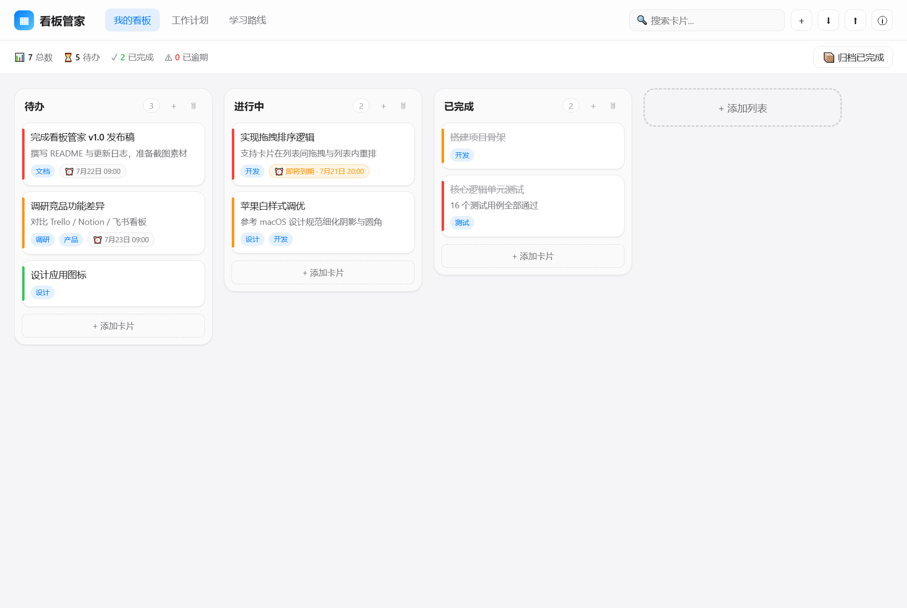

# 看板管家 · Kanban Manager

> 苹果白风格的本地优先看板任务管理工具。卡片拖拽、标签、截止日期、优先级、归档与导入导出一应俱全，数据完全本地存储，离线可用。

   

## ✨ 功能特色

- **看板视图**：多看板切换，每个看板支持多个列表与卡片
- **拖拽排序**：卡片在列表间拖拽移动，列表内自由排序
- **优先级标识**：低 / 中 / 高三档优先级，左侧色条直观展示
- **标签系统**：每张卡片可贴多个标签，支持搜索
- **截止日期**：临近到期橙色提醒，已逾期红色高亮
- **完成归档**：移入「已完成」列表自动标记完成，一键归档清理
- **全局搜索**：跨列表搜索卡片标题、描述、标签
- **导入导出**：JSON 数据备份与恢复
- **本地优先**：数据存储在用户目录，无需联网，隐私可控
- **苹果白风格**：浅色背景、细腻阴影、系统字体、`#007aff` 蓝色强调

## 📦 下载安装

### 方式一：下载安装包
前往 [Releases 页面](https://github.com/grrtyre/youqu/releases) 搜索 `KanbanManager`，下载最新版 `KanbanManager-1.0.0-Setup.exe` 双击安装即可。

### 方式二：源码运行
```bash
git clone https://github.com/grrtyre/youqu.git
cd youqu/kanban-manager
npm install
npm start
```

## 🚀 快速上手

1. **新建列表**：在看板右侧点击「+ 添加列表」
2. **添加卡片**：点击列表底部「+ 添加卡片」，填写标题、描述、标签、截止日期、优先级
3. **拖拽移动**：按住卡片拖到其他列表或列表内任意位置
4. **完成卡片**：拖入「已完成」列表自动标记完成
5. **搜索**：右上角搜索框输入关键词，回车查找卡片
6. **归档**：状态栏点击「📦 归档已完成」清理已完成卡片
7. **备份**：菜单「文件 → 导出数据」生成 JSON 备份文件

## ⌨️ 快捷键

| 快捷键 | 功能 |
|--------|------|
| `Ctrl + E` | 导出数据 |
| `Ctrl + I` | 导入数据 |
| `Ctrl + C / V` | 复制 / 粘贴 |
| `Ctrl + Z / Y` | 撤销 / 重做 |
| `Ctrl + = / -` | 放大 / 缩小 |
| `F11` | 全屏 |

## 📁 项目结构

```
kanban-manager/
├── src/
│   ├── main.js              # Electron 主进程
│   ├── preload.js           # 安全 IPC 桥
│   ├── renderers/
│   │   └── index.html       # 主界面
│   ├── scripts/
│   │   ├── store.js         # 核心数据逻辑（纯函数可测）
│   │   └── app.js           # 渲染进程入口
│   └── styles/
│       └── app.css          # 苹果白样式
├── test/
│   └── run-tests.js         # 核心逻辑单元测试
├── build/
│   ├── icon.ico             # 应用图标
│   └── icon.png             # 应用图标 PNG
├── package.json
├── LICENSE
└── README.md
```

## 🛠️ 技术栈

- **框架**：Electron 28
- **前端**：原生 HTML/CSS/JavaScript（无框架依赖）
- **数据**：本地 JSON 文件存储
- **测试**：Node.js assert 原生测试
- **打包**：electron-builder

## 🎨 设计规范

- 主色：`#007aff`（苹果蓝）
- 背景：`#f5f5f7`（苹果灰白）
- 卡片白：`#ffffff`
- 字体：`-apple-system, BlinkMacSystemFont, "Segoe UI", "PingFang SC"`
- 圆角：8 / 12 / 16 / 20px 四级
- 阴影：细腻低饱和（`rgba(0,0,0,0.04~0.08)`）

## 📸 效果截图



## 📝 更新日志

### v1.0.0 · 2026-07-20
- 首个正式版本
- 看板 / 列表 / 卡片三层结构
- 拖拽排序与跨列表移动
- 标签、截止日期、优先级系统
- 全局搜索与归档功能
- JSON 导入导出
- 苹果白高端风格 UI

## ☕ 支持我们

如果这个工具对你有帮助，欢迎到 [爱发电](https://www.ifdian.net/a/giquwei) 支持我们，一杯咖啡也是继续创造的动力。

## 🙏 鸣谢

感谢以下朋友的支持（按支持时间排序）：

<!-- 鸣谢名单占位 -->

_暂无，期待第一个支持者的出现。_

## 📄 License

MIT License © 2026 youqu
