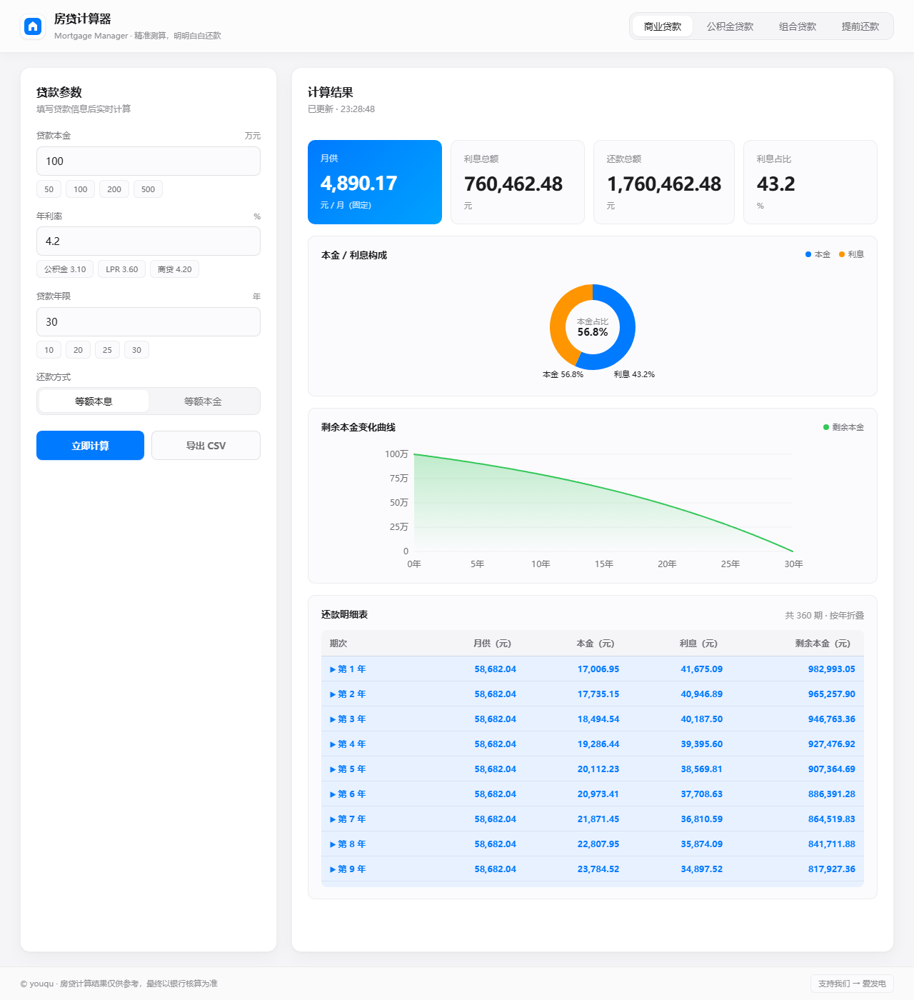

# 🏠 房贷计算器 · Mortgage Manager

> 一款 macOS 风格、苹果白高端审美的本地房贷计算器桌面应用。支持商业贷款、公积金贷款、组合贷款与提前还款测算，所有计算在本地完成，无需联网。


---

## ✨ 功能特性

- **三种贷款模式**：商业贷款 / 公积金贷款 / 组合贷款，一键切换
- **两种还款方式**：等额本息、等额本金，结果实时呈现
- **提前还款测算**：支持「缩短年限」与「减少月供」两种策略，自动计算节省利息
- **完整还款明细**：按年折叠的期供表，可展开查看每月本金/利息/剩余本金
- **可视化图表**：本金-利息构成饼图 + 剩余本金变化曲线
- **快捷输入**：常用本金/利率/年限一键填入
- **CSV 导出**：还款计划一键保存为 CSV，方便 Excel 打开
- **隐私安全**：所有计算在本地完成，不联网、不上传任何数据
- **苹果白高端风格**：白色背景、细腻阴影、系统字体、`#007aff` 蓝色强调

## 📥 下载安装

| 平台 | 下载 | 说明 |
| --- | --- | --- |
| Windows | 见 [Releases](https://github.com/grrtyre/youqu/releases) | 推荐 Win10/Win11 x64 |
| 便携版 | 见 [Releases](https://github.com/grrtyre/youqu/releases) | 单文件 EXE，免安装 |

> 进入 Releases 页面，查找 tag 形如 `mortgage-manager-vX.Y.Z` 的版本，下载对应资产即可。

## 🎨 效果展示

<p align="center">
  
</p>

> 苹果白风格：浅灰背景 + 白色卡片 + 蓝色主调，干净、克制、专注内容。

## ⌨️ 快捷键

| 快捷键 | 功能 |
| --- | --- |
| `Enter` | 在输入框内回车，立即计算 |
| `Tab` | 在表单字段间切换焦点 |
| 点击「年份」行 | 展开/收起该年每月明细 |

## 🗂 项目结构

```
mortgage-manager/
├── main.js              # Electron 主进程
├── preload.js           # 上下文桥接（CSV 保存对话框）
├── src/
│   ├── index.html       # 应用界面
│   ├── styles.css       # 苹果白样式
│   ├── renderer.js      # UI 交互 + 图表绘制
│   └── calc.js          # 核心计算引擎（纯函数，可测试）
├── test/
│   └── calc.test.js     # 单元测试（16 项）
├── build/
│   └── icon.ico         # Windows 应用图标
├── assets/
│   └── icon.png         # PNG 图标源
├── package.json
├── README.md
├── LICENSE
└── .gitignore
```

## 🚀 本地运行

```bash
# 安装依赖（已配置国内镜像加速）
npm install

# 开发模式启动
npm start

# 运行单元测试
npm test

# 打包 Windows 安装版 + 便携版
npm run build
```

## 📝 更新日志

### v1.0.0 · 2026-07-19

- 首次发布
- 支持商业贷款、公积金贷款、组合贷款
- 支持等额本息、等额本金两种还款方式
- 支持提前还款两种策略测算（缩短年限 / 减少月供）
- 苹果白高端风格 UI、饼图与折线图可视化
- 还款明细按年折叠展示，支持 CSV 导出
- 16 项核心计算单元测试全部通过

## ☕ 支持我们

如果这个工具对你有帮助，欢迎请我们喝杯咖啡 →
[爱发电 · giquwei](https://www.ifdian.net/a/giquwei)

## 🙏 鸣谢

感谢以下朋友的支持（按支持时间排序）：

<!-- 鸣谢名单占位 -->

_暂无，期待第一个支持者的出现。_

## 📄 License

MIT License © youqu
