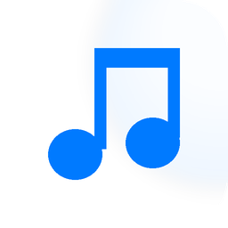

<div align="center">



# 音乐管家 · Music Player

**苹果白高端风格的本地音乐播放器**

简洁 · 纯粹 · 不打扰

[](https://github.com/grrtyre/youqu/releases)
[](https://github.com/grrtyre/youqu/tree/main/music-player)
[](./LICENSE)

</div>

<br>

> 一个安静、不打扰的本地音乐播放器。白底、细腻阴影、系统字体、`#007aff` 蓝色强调——把「苹果白」带进每一首播放。
> **所有音频本地解码，播放列表本地保存，零网络请求、零上传、零遥测。**

<p align="center">
  
</p>

---

## 📊 亮点速览

| 本地播放 | 多格式 | 动态封面 | 隐私 |
|:---:|:---:|:---:|:---:|
| 文件 / 文件夹 / 拖拽 | 6 种音频格式 | 渐变封面生成 | 0 网络请求 |
| 顺序 / 随机 / 循环 | MP3 · WAV · FLAC | 按歌名生成 | 0 上传追踪 |
| 8 首列表演示 | OGG · M4A · AAC | 一键封面预览 | 0 账号登录 |

---

## ✨ 功能特性

<table class="feature-cards">
<tr>
<td width="50%" valign="top">

### 🎧 播放核心

- **完整播放控制** — 播放 / 暂停 / 上一首 / 下一首 / 进度拖拽 / 音量
- **四种循环模式** — 顺序 · 随机 · 列表循环 · 单曲循环
- **6 种音频格式** — MP3 / WAV / OGG / FLAC / M4A / AAC
- **精准进度条** — 拖拽即跳转，实时显示当前 / 总时长

</td>
<td width="50%" valign="top">

### 📁 导入与列表

- **多种导入方式** — 添加文件 / 文件夹 / 直接拖拽
- **列表持久化** — 重启自动恢复列表与进度
- **列表管理** — 移除单曲 · 清空列表 · 双击播放

</td>
</tr>
<tr>
<td width="50%" valign="top">

### 🎨 视觉设计

- **苹果白美学** — `#ffffff` 主背景、细腻阴影、系统圆角
- **动态渐变封面** — 按歌名哈希生成，每首独一无二
- **系统字体** — `-apple-system / SF Pro / PingFang SC`
- **强调色** — `#007aff` 蓝色点缀，不喧宾夺主

</td>
<td width="50%" valign="top">

### 🔒 隐私优先

- **零网络请求** — 全程离线运行，不发起任何连接
- **零上传追踪** — 歌单与播放记录只存本地磁盘
- **零账号登录** — 无需注册，打开即用

</td>
</tr>
</table>

---

## 📦 下载

<table>
<tr>
<th width="22%" align="left">🖥️ 平台</th>
<th width="30%" align="left">📦 安装包</th>
<th width="12%" align="left">📏 大小</th>
<th width="36%" align="left">📝 说明</th>
</tr>
<tr>
<td><strong>Windows x64</strong></td>
<td><a href="../../releases/latest"><code>MusicPlayer-Setup.exe</code></a></td>
<td>~85 MB</td>
<td>NSIS 安装程序，可自选目录、建桌面快捷方式</td>
</tr>
</table>

> 💡 便携版单文件 EXE 正在打磨中，敬请期待。

---

## 🚀 快速开始

### ⭐ 方式一：直接使用（推荐）

1. 下载上方 `MusicPlayer-Setup.exe`
2. 双击安装（可自选安装目录）
3. 从开始菜单或桌面快捷方式启动
4. 把音乐文件拖进窗口即可播放

### 🛠️ 方式二：从源码运行

```bash
git clone https://github.com/grrtyre/youqu.git
cd youqu/music-player
npm install
npm start
```

---

## ⌨️ 快捷键

| 快捷键 | 功能 | 说明 |
| --- | --- | --- |
| `Space` | **播放 / 暂停** | 全局可用 |
| `Ctrl + N` | **下一首** | 立即切换 |
| `Ctrl + P` | **上一首** | 回到上一曲 |
| `Shift + ←` | **快退 5 秒** | 精细定位 |
| `Shift + →` | **快进 5 秒** | 跳过间奏 |
| `↑` | **音量加** | 每次 +5% |
| `↓` | **音量减** | 每次 -5% |
| `Ctrl + S` | **保存列表** | 手动持久化 |
| `Delete` | **移除选中** | 从列表删除 |

---

## 📁 项目结构

```text
music-player/
├── src/
│   ├── main.js              # Electron 主进程
│   ├── preload.js           # 安全 IPC 桥接
│   ├── renderer/
│   │   ├── index.html       # 主界面
│   │   ├── styles.css       # 苹果白样式系统
│   │   └── app.js           # 播放与列表逻辑
│   └── assets/
│       └── icon.png         # 应用图标
├── test/
│   └── test.js              # 单元测试
├── build/                   # 各尺寸图标
├── package.json
├── LICENSE
└── README.md
```

---

## 🛠️ 技术栈

| 技术 | 角色 | 说明 |
| --- | --- | --- |
| **Electron 30** | 应用框架 | 跨平台桌面运行时 |
| **原生 HTML5 Audio** | 音频引擎 | 无第三方解码依赖 |
| **原生 CSS** | 设计系统 | 苹果白设计语言，无 UI 框架 |
| **IPC + Preload** | 进程通信 | contextBridge 安全隔离 |

---

## 🎨 设计语言

| 设计元素 | 数值 | 用途 |
| --- | --- | --- |
| 主背景 | `#ffffff` | 窗口底色 |
| 次背景 | `#f5f5f7` | 卡片 / 列表区 |
| 主文字 | `#1d1d1f` | 标题 / 正文 |
| 次文字 | `#6e6e73` | 辅助说明 |
| 强调色 | `#007aff` | 按钮 / 进度 / 选中态 |
| 圆角 | 6 / 10 / 16 / 20 px | 分层圆角系统 |
| 字体 | `-apple-system, SF Pro, PingFang SC` | 系统原生字体栈 |

---

## 📝 更新日志

### v1.0.0 · 2026-07-18

- 🎉 **首次发布**
- ✅ 完整播放列表管理（增删 / 双击播放）
- ✅ 三种导入方式（文件 / 文件夹 / 拖拽）
- ✅ 顺序 / 随机 / 列表循环 / 单曲循环
- ✅ 播放列表持久化，重启自动恢复
- ✅ 6 种音频格式支持
- ✅ 动态渐变封面生成
- ✅ 苹果白 UI 设计系统
- ✅ 全局快捷键控制

---

## ☕ 支持我们

如果音乐管家陪你度过了一段安静的时光，欢迎请我们喝杯咖啡：

[](https://www.ifdian.net/a/giquwei)

你的支持是我们持续打磨细节的动力。

---

## 🙏 鸣谢

感谢以下朋友的支持（按支持时间排序）：

<!-- 鸣谢名单占位 -->

_暂无，期待第一个支持者的出现。_

---

## 📄 许可证

[MIT License](./LICENSE) © 2026 youqu
