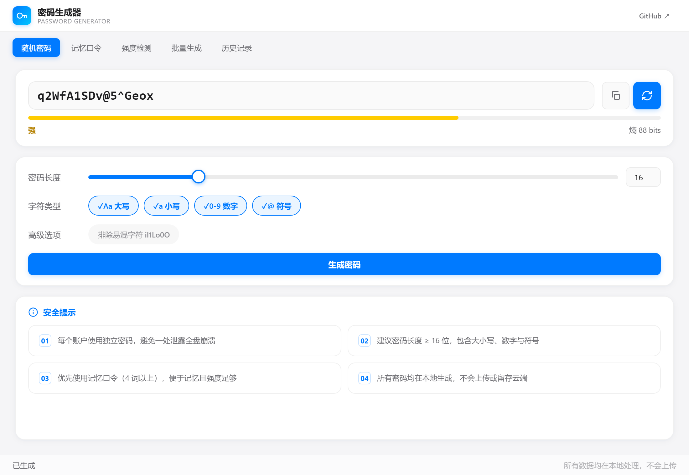

<div align="center">


# 🔐 密码生成器 · Password Generator

**苹果白高端风格的本地密码生成与管理工具**

基于 Node.js `crypto` 模块 · CSPRNG 密码学安全随机数 · 拒绝采样消除模偏置 · 纯本地离线运行

[](../../releases)
[](https://github.com/grrtyre/youqu)
[](LICENSE)
[](https://www.electronjs.org)
[](https://github.com/grrtyre/youqu)

</div>

> 🔒 **所有密码均在本地生成，不会上传或留存云端。** 拒绝 `Math.random()`，使用 Node.js `crypto` 模块密码学安全随机数（CSPRNG）+ 拒绝采样消除模偏置，每一次生成都符合工业级安全标准。

---

## ✨ 核心亮点

| 亮点 | 说明 |
| --- | --- |
| 🛡️ **工业级安全** | Node.js `crypto` 模块 CSPRNG，与银行系统同级；拒绝采样消除模偏置，杜绝伪随机偏差 |
| 🎨 **苹果白高端风格** | `#f5f5f7` 背景 / `#ffffff` 卡片 / `#007aff` 蓝色强调，参考 macOS/iOS 原生设计 |
| ⚡ **5 种场景预设** | PIN / WiFi / 标准 / 高强 / 极强，一键套用配置并生成，告别参数纠结 |
| 🧠 **可记忆口令** | 80 词词库，3-8 词英文组合，便于人类记忆，适合日常账号 |
| 📊 **熵值可视化** | 基于 Shannon 熵实时评估，估算离线破解耗时，强度色阶一目了然 |
| 🌈 **字符高亮** | 密码区按字符类型上色（数字蓝 / 符号橙 / 字母默认），可读性倍增 |

---

## 🖼️ 效果展示

<p align="center">
  
</p>

<p align="center"><em>苹果白主界面 · 字符高亮（数字蓝 / 符号橙）· 强度渐变条 · 五种快速预设 · 实时熵值与破解耗时</em></p>

---

## ✨ 功能特性

| 模块 | 说明 |
| --- | --- |
| 🔑 **随机密码** | 4-64 位自定义长度，支持大小写、数字、符号，可排除易混字符 `il1Lo0O` |
| ⚡ **快速预设** | 内置 PIN / WiFi / 标准 / 高强 / 极强 五种场景，一键套用配置并生成 |
| 🎨 **字符高亮** | 密码展示区按字符类型上色（数字蓝 / 符号橙 / 字母默认），提升可读性 |
| 🧠 **记忆口令** | 3-8 词英文单词组合（80 词词库），可选分隔符、首字母大写、附加数字 |
| 📊 **强度检测** | 基于 Shannon 熵的实时评估，估算离线破解耗时，给出改进建议 |
| 📋 **批量生成** | 一次生成 5-50 个密码，一键复制全部 |
| 🕐 **历史记录** | 本地保存最近 50 条记录（localStorage），可随时清空 |

---

## 📦 下载安装

| 类型 | 文件名 | 说明 | 链接 |
| --- | --- | --- | --- |
| **便携版** | `PasswordGenerator-1.1.0-x64.exe` | 单文件 EXE，免安装即用，可放 U 盘 | [Releases](../../releases) |
| **安装版** | `PasswordGenerator-Setup-1.1.0-x64.exe` | NSIS 安装程序，可选路径、桌面快捷方式 | [Releases](../../releases) |
| **源码版** | `git clone` | 自行编译运行，可二次定制 | [源码](.) |

> **最低系统要求：** Windows 10 1809+ · 80MB 可用空间 · 64 位

### 🚀 快速开始

```bash
# 1. 下载便携版 EXE（推荐）
#    从 Releases 页面下载 PasswordGenerator-1.1.0-x64.exe
# 2. 双击运行，无需安装

# 或从源码运行
git clone https://github.com/grrtyre/youqu.git
cd youqu/password-generator
npm install --registry=https://registry.npmmirror.com
npm start
```

### 源码运行

```bash
# 安装依赖（建议使用淘宝镜像加速）
npm install --registry=https://registry.npmmirror.com

npm start      # 启动应用
npm test       # 运行测试（16 个单元测试）
npm run build  # 打包
```

---

## ⌨️ 快捷键

| 快捷键 | 功能 | 说明 |
| --- | --- | --- |
| `Enter` | 生成密码 / 口令 | 当前 Tab 上下文生成 |
| `Ctrl + C` | 复制当前密码 | 在密码显示区域按下 |
| `Tab` | 切换 Tab 标签页 | 顺序：随机 / 口令 / 强度 / 批量 / 历史 |
| `Esc` | 清空强度检测输入 | 仅在强度检测 Tab 生效 |

---

## 🎯 使用场景

| 场景 | 推荐预设 | 长度 | 说明 |
| --- | --- | --- | --- |
| 💳 银行 / 支付账户 | 极强 | 24 位 | 大小写 + 数字 + 符号，含易混字符排除 |
| 📶 WiFi 密码 | WiFi | 16 位 | 易输入，无易混字符 |
| 🔢 锁屏 PIN | PIN | 6 位 | 纯数字 |
| 📧 邮箱 / 社交账号 | 标准 | 12 位 | 平衡强度与记忆 |
| 🧠 可记忆口令 | 记忆口令 | 4 词 | 英文单词组合，便于记忆 |

---

## 🎨 设计规范

| 维度 | 规范 |
| --- | --- |
| **配色** | 苹果白 `#f5f5f7` 背景 / `#ffffff` 卡片 / `#007aff` 蓝色强调 |
| **阴影** | `0 2px 12px rgba(0,0,0,0.04), 0 1px 3px rgba(0,122,255,0.03)` |
| **字体** | `-apple-system, BlinkMacSystemFont, "Segoe UI", "PingFang SC"` |
| **圆角** | 8px / 12px / 16px 三级圆角体系 |
| **强度色** | 六阶语义渐变：红 → 橙 → 黄 → 绿 → 深绿 → 蓝 |
| **风格** | 禁止赛博朋克霓虹、深色毛玻璃 |

---

## 🔬 安全实现

### 密码学安全随机数（CSPRNG）

```javascript
// 使用 Node.js crypto 模块，非 Math.random()
function secureRandomInt(max) {
  const maxUint32 = 0xFFFFFFFF;
  const limit = maxUint32 - (maxUint32 % max);  // 拒绝采样消除模偏置
  const buf = crypto.randomBytes(4);
  let val = buf.readUInt32BE(0);
  while (val >= limit) {
    val = crypto.randomBytes(4).readUInt32BE(0);  // 超出范围则重采样
  }
  return val % max;
}
```

### 强度评估算法

- **熵值计算：** `entropy = length × log2(poolSize)`
- **评分等级：** 0-6 分（无 / 极弱 / 弱 / 一般 / 强 / 很强 / 极强）
- **破解估算：** 假设离线攻击速度 10¹⁰ 次/秒（GPU 集群规模）

---

## 📁 项目结构

```
password-generator/
├── main.js              # Electron 主进程 + 密码生成核心逻辑
├── preload.js           # 预加载脚本（contextBridge 安全桥接）
├── package.json         # 项目配置 + electron-builder 打包配置
├── src/
│   ├── index.html       # 渲染进程 HTML（5 个 Tab 面板）
│   ├── styles.css       # 苹果白风格样式表
│   └── renderer.js      # 渲染进程逻辑 + 截图回退 mock
├── test/
│   └── test.js          # 16 个单元测试（Node assert）
├── assets/
│   ├── icon.png         # 应用图标（256×256）
│   ├── icon.ico         # Windows 多尺寸图标
│   └── preview-main.png # 主界面示意图（PIL 生成）
├── screenshots/
│   └── password-generator-main.png  # 主界面真实截图
├── LICENSE              # MIT 许可证
└── README.md            # 项目说明
```

---

## ❓ 常见问题

<details>
<summary><b>Q1：生成的密码真的安全吗？会被上传吗？</b></summary>

**完全安全，不会上传。** 使用 Node.js `crypto` 模块的 CSPRNG（密码学安全随机数生成器），与银行系统同级。所有密码在本地内存中生成，复制后仅 localStorage 历史记录保留（可一键清空），不发送任何网络请求。

</details>

<details>
<summary><b>Q2：为什么排除易混字符 il1Lo0O？</b></summary>

这些字符在无衬线字体中极易混淆（`i` 与 `l` 与 `1`，`L` 与 `l`，`o` 与 `0` 与 `O`），手动抄写或口头传达时容易出错。开启后，生成的密码更便于人工识别与输入，常用于 WiFi 密码等需要分享的场景。

</details>

<details>
<summary><b>Q3：记忆口令真的比随机密码好吗？</b></summary>

各有适用场景。4 词记忆口令（如 `correct-horse-battery-staple`）熵值约 51 bits，虽低于 16 位随机密码（105 bits），但**便于人类记忆**，适合日常账号；高安全场景（银行、支付）仍建议使用随机密码 + 密码管理器。

</details>

<details>
<summary><b>Q4：便携版和安装版有什么区别？</b></summary>

功能完全一致。便携版为单文件 EXE，可放 U 盘随身携带，不写注册表；安装版会创建开始菜单快捷方式和卸载入口，适合长期使用。

</details>

---

## 📝 更新日志

### v1.1.0 (2026-07-17)
- ⚡ 新增「快速预设」：PIN / WiFi / 标准 / 高强 / 极强 五种场景一键套用
- 🌈 新增密码字符高亮：数字蓝色、符号橙色，提升可读性与高级感
- 📊 密码卡片新增元信息行（长度 / 字符池 / 熵值 / 破解耗时）
- 🔤 等宽字体精修：扩展字体栈（JetBrains Mono / Cascadia Code），关闭连字，启用 tabular-nums
- 🎚️ 滑块精修：thumb 居中修正、hover 环扩展、active 反馈、Firefox 兼容
- 📈 强度条语义色精修：六阶平滑渐变 + 同色微光，语义更清晰

### v1.0.0 (2026-07-15)
- 🎉 首次发布
- ✅ 随机密码生成（4-64 位，支持字符类型与易混字符排除）
- ✅ 记忆口令生成（3-8 词，80 词词库）
- ✅ 强度检测（熵值 + 破解耗时估算）
- ✅ 批量生成（5-50 个）
- ✅ 本地历史记录（最多 50 条）
- ✅ 苹果白高端风格 UI

> 完整更新日志请见 [Releases](../../releases)

---

## ☕ 支持我们

如果这个工具对你有帮助，欢迎请我们喝杯咖啡 ☕ 您的支持是我们持续优化的动力！

<div align="center">

[](https://www.ifdian.net/a/giquwei)

**爱发电链接：** https://www.ifdian.net/a/giquwei

</div>

---

## 🙏 鸣谢

感谢以下朋友的支持（按支持时间排序）：

<!-- 鸣谢名单占位：支持者姓名将在此处展示，格式：- [@用户名](主页链接) 或 - 张三 -->

_暂无，期待第一个支持者的出现。_

### 🌟 技术致谢

| 项目 | 用途 | 链接 |
| --- | --- | --- |
| Electron | 跨平台桌面应用框架 | [electronjs.org](https://www.electronjs.org) |
| Node.js `crypto` | 密码学安全随机数 | [nodejs.org](https://nodejs.org/api/crypto.html) |
| electron-builder | 应用打包与分发 | [electron.build](https://www.electron.build) |

---

## 📄 许可证

[MIT License](LICENSE) · Copyright (c) 2026 youqu

<div align="center">
<sub>Built with 🔒 for users who care about password security</sub>
</div>

---

## 🔗 相关项目

密码生成器是 [youqu 工具集](https://github.com/grrtyre/youqu) 的一员，更多苹果白风格的实用小工具欢迎访问主仓库。
