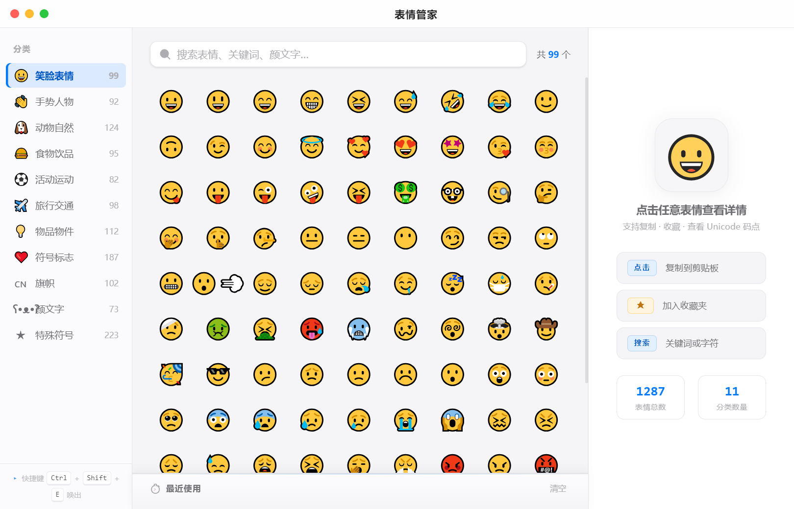

<div align="center">

# 🍅 番茄管家

**本地优先的番茄工作法专注桌面应用**

专注 · 休息 · 心流 · 打卡 · 统计


</div>

> 用经典番茄工作法管理专注与休息，配合任务清单、统计分析与连续打卡，帮你进入心流。
> 所有数据存本地，无网络请求，隐私优先。

<p align="center">
  
</p>

## ⬇️ 直接下载

| 平台 | 下载 | 版本 |
|---|---|---|
| Windows (x64) | [pomodoro-manager-setup-1.1.0.exe](https://github.com/grrtyre/youqu/releases/download/pomodoro-manager-v1.1.0/pomodoro-manager-setup-1.1.0.exe) | v1.1.0 |

> 前往 [Release 页面](https://github.com/grrtyre/youqu/releases/tag/pomodoro-manager-v1.1.0) 查看所有版本。

## ✨ 功能特性

### 🍅 计时核心

- **三阶段轮转**：专注 / 短休息 / 长休息自动轮转，每 4 个番茄进入长休息
- **圆环进度**：SVG 矢量圆环，阶段色随状态变化
- **呼吸光晕**：计时运行中圆环微妙脉动，让「正在专注」有生命感
- **完成庆祝**：圆环扩散波纹 + 时间数字弹跳，仪式感拉满

### 📋 任务管理

- **任务清单**：添加任务并预估番茄数，设为当前任务后自动累计进度
- **番茄进度条**：每个任务实时显示 pomodoros/estimate 可视化进度，一眼掌握完成度
- **inline 编辑**：双击任务标题原地修改，回车保存、Esc 取消
- **完成 / 删除**：一键标记完成，悬停显示删除，误删可撤销

### 📊 统计与激励

- **多维统计**：今日进度、专注分钟数、本周番茄数、累计专注时长
- **7 天柱状图**：最近一周专注趋势一目了然
- **专注热力图**：13 周贡献图，一眼看清长期专注节奏
- **周目标进度**：自定义每周目标，稳步积累
- **连续打卡**：达成每日目标自动累计连续天数 🔥

### ⚙️ 专注守护

- **严格模式**：不可跳过休息，守护番茄节奏
- **自动开始**：工作结束自动进入休息，休息结束自动进入专注
- **提示音**：Web Audio 合成清脆钟声，零外部依赖
- **白噪音**：内置合成背景音，屏蔽环境干扰

### 🖥 系统集成

- **托盘常驻**：右键菜单快速控制，关闭窗口不退出
- **桌面通知**：番茄完成 / 休息结束自动通知，点击唤起
- **数据备份**：JSON 格式导入导出，纯本地隐私优先

## 🚀 快速开始

**直接下载（推荐）** —— 下载 `pomodoro-manager-setup-1.1.0.exe`，双击安装。

**源码运行：**

```bash
git clone https://github.com/grrtyre/youqu.git
cd youqu/pomodoro-manager
npm install
npm start
```

## ⌨️ 快捷键

| 操作 | 快捷键 |
|---|---|
| 开始 / 暂停 | `空格` |
| 重置 | `R` |
| 跳过 | `S` |
| 切换阶段 | `1` / `2` / `3` 或点击顶部标签 |
| 新建任务 | `N` 聚焦输入框 |
| 添加任务 | 输入 + `回车` |
| 编辑任务 | 双击任务 |
| 设置 | 齿轮图标 |

## 🛠 技术栈

- **Electron 28** + 原生 JavaScript
- **Web Audio API** —— 合成提示音与白噪音
- **本地 JSON** —— 原子写入 + 自动备份
- **苹果白设计** —— #007aff 强调色

## 📁 项目结构

```
pomodoro-manager/
├── src/
│   ├── core/pomodoro-core.js   # 核心状态机
│   ├── renderer/
│   │   ├── index.html          # 主界面
│   │   ├── styles.css          # 苹果白样式
│   │   └── renderer.js         # 渲染逻辑
│   ├── main.js                 # Electron 主进程
│   └── preload.js              # 预加载桥接
├── test/test.js                # 119 项测试
└── package.json
```

## 📜 更新日志

**v1.4.0** —— 视觉精修与配色统一：streak 徽章改为蓝色主题（与整体配色一致，消除橙蓝冲突）、热力图色阶回归苹果蓝单色系 5 级、图例简化为 3 级（减少视觉噪音）、卡片标题字号 15→16px 并加粗（强化字体层次）、快捷键提示加大（10→12px，提升可读性）、任务进度条与主进度条风格统一（同色同圆角）、环形进度条 stroke-width 统一为 10（消除毛刺）、左右分栏比例调整（286→310px，平衡视觉重心）、任务输入区增加分隔线、火焰动效更克制

**v1.3.1** —— 专注热力图自定义 tooltip（苹果白样式，替代原生 title，显示日期+番茄数）、任务空状态视觉升级（番茄图标+主副标题）、快捷键提示精修（柔和胶囊容器+蓝色 kbd 标签）、README 测试用例数同步（87→119）

**v1.3.0** —— 任务番茄进度条（可视化 pomodoros/estimate）、`N` 键快速新建任务、连续打卡火焰动效增强、当前任务条与计时圆环视觉整合、任务间距统一；修复截图演示模式启动崩溃

**v1.2.0** —— 专注热力图（13 周贡献图）、周目标进度条、每周目标自定义

**v1.1.0** —— 呼吸光晕、完成庆祝动效、任务 inline 编辑、内置白噪音

**v1.0.0** —— 番茄计时器、任务清单、统计分析、连续打卡、严格模式、托盘常驻

## ☕ 支持我们

如果番茄管家帮到了你，欢迎在爱发电请我们喝杯咖啡：

👉 [https://www.ifdian.net/a/giquwei](https://www.ifdian.net/a/giquwei)

## 🙏 鸣谢

感谢以下朋友的支持（按支持时间排序）：

<!-- 鸣谢名单占位：有了支持者后在这里添加 -->

_暂无，期待第一个支持者的出现。_

## 📄 License

[MIT](./LICENSE)
