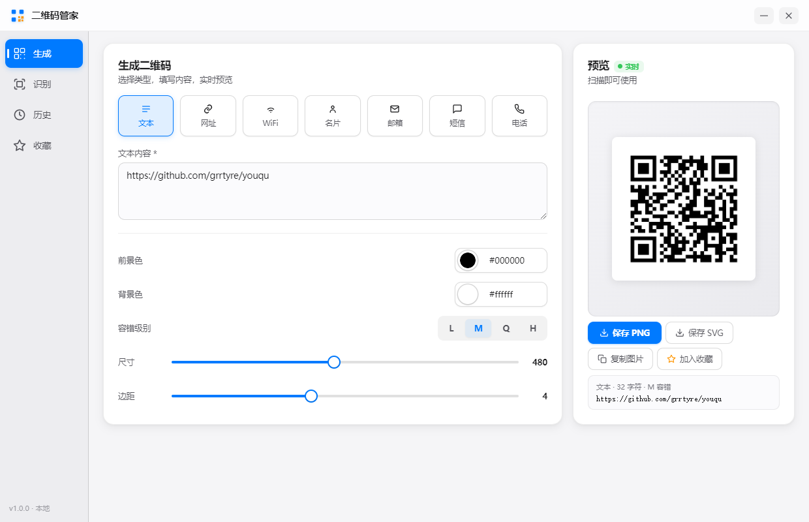

<div align="center">

# 📱 二维码管家

**本地优先的二维码生成与识别桌面工具**

生成 · 识别 · 收藏 · 导出 · 苹果白高端风格


</div>

> 支持 WiFi / 名片 / 邮箱等 7 种模板 · 截屏框选识别 · 历史收藏 · PNG/SVG 导出 · 纯本地离线运行无上传

---

## 效果展示

<p align="center">
  
</p>

## ✨ 功能特性

| 分类 | 能力 | 说明 |
|---|---|---|
| 多类型生成 | 7 种模板 | 文本、网址、WiFi、名片（vCard）、邮箱、短信、电话，一键切换 |
| 实时预览 | 所见即所得 | 输入即生成，右侧自动刷新预览 |
| 自定义样式 | 颜色 / 容错 / 尺寸 | 前景背景色、容错级别（L/M/Q/H）、尺寸、边距自由调节 |
| 截屏识别 | 框选屏幕 | 选择屏幕区域，直接识别其中的二维码 |
| 图片识别 | 拖拽 / 选择 | 支持拖拽或选择本地图片文件识别二维码 |
| 历史记录 | 自动保存 | 生成与识别历史自动保存，一键复用 |
| 收藏管理 | 常用收藏 | 常用二维码加入收藏，快速访问 |
| 导出格式 | PNG / SVG | 支持位图与矢量两种导出格式 |
| 本地存储 | 离线安全 | 所有数据存储在本地，无需联网，不上传 |

## ⬇️ 下载与使用

| 方式 | 下载 | 说明 |
|---|---|---|
| Windows 安装版 | [QR-Manager-Setup-1.0.0.exe](https://github.com/grrtyre/youqu/releases/download/qr-manager-v1.0.0/QR-Manager-Setup-1.0.0.exe) | NSIS 安装程序，支持自定义安装路径 |
| Windows 便携版 | [QR-Manager-Portable-1.0.0.exe](https://github.com/grrtyre/youqu/releases/download/qr-manager-v1.0.0/QR-Manager-Portable-1.0.0.exe) | 免安装，解压即用 |

> 前往 [Releases 页面](../../releases) 查看所有版本。

## 📖 使用方式

### 生成二维码

1. 选择类型（文本 / 网址 / WiFi / 名片等）
2. 填写内容，右侧自动生成预览
3. 调整颜色、容错级别、尺寸等样式
4. 点击「保存 PNG」或「保存 SVG」导出

### 识别二维码

1. 切换到「识别」视图
2. 选择「选择图片」或「截屏识别」
3. 识别结果自动显示，可复制或加入收藏

### WiFi 二维码示例

填写 WiFi 名称和密码，生成后手机扫码即可连接，无需手动输入密码。

## ⌨️ 快捷键

| 快捷键 | 功能 |
|---|---|
| `Ctrl + 1~7` | 切换生成类型（文本/网址/WiFi/名片/邮箱/短信/电话） |
| `Ctrl + S` | 保存当前二维码为 PNG |
| `Ctrl + Shift + S` | 保存当前二维码为 SVG |
| `Ctrl + Shift + X` | 截屏识别 |
| `Ctrl + H` | 查看历史记录 |
| `Ctrl + F` | 查看收藏列表 |
| `Esc` | 关闭弹窗 / 取消截屏 |

## 📁 项目结构

```
qr-manager/
├── main.js              # Electron 主进程
├── index.html           # 页面结构
├── styles.css           # 苹果白高端风格样式
├── renderer.js          # 渲染进程（生成、识别、历史、收藏）
├── qrcode.min.js        # 二维码生成库
├── jsQR.js              # 二维码识别库
├── assets/              # 图标等静态资源
├── package.json
├── .gitignore
├── LICENSE
└── README.md
```

## 🛠 技术栈

- **Electron 28** — 跨平台桌面框架
- **qrcode** — 二维码生成
- **jsQR** — 二维码识别
- **electron-store** — 本地数据持久化
- 纯原生 HTML/CSS/JS，无框架依赖
- **苹果白高端风格** — 参考 macOS/iOS 原生设计，白色/浅灰背景、细腻阴影、系统字体、`#007aff` 蓝色强调

## 💻 开发

```bash
# 安装依赖
npm install

# 运行测试
npm test

# 启动开发
npm start

# 打包
npm run dist
```

## 📝 更新日志

### v1.0.0（初始版本）

**核心功能：**
- 7 种二维码类型生成（文本、网址、WiFi、名片、邮箱、短信、电话）
- 实时预览，输入即生成
- 自定义前景/背景色、容错级别（L/M/Q/H）、尺寸、边距
- 截屏框选识别 + 图片拖拽识别
- 历史记录自动保存与一键复用
- 收藏管理常用二维码
- PNG / SVG 双格式导出
- 纯本地存储，离线安全运行

## ☕ 支持我们

如果这个工具帮到了你，欢迎在爱发电请我们喝杯咖啡：

👉 [https://www.ifdian.net/a/giquwei](https://www.ifdian.net/a/giquwei)

你的支持是我们持续做下去的动力。

## 🙏 鸣谢

感谢以下朋友的支持（按支持时间排序）：

<!-- 鸣谢名单占位：有了支持者后在这里添加，格式：- [@用户名](主页链接) -->

_欢迎成为第一位支持者。_

## 📄 License

[MIT License](./LICENSE) —— 可自由使用、修改、分发。

## 🔗 相关项目

二维码管家是 [youqu 工具集](https://github.com/grrtyre/youqu) 的一员，更多苹果白风格的实用小工具欢迎访问主仓库。
