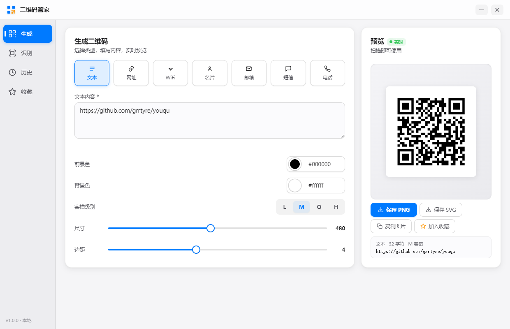

<div align="center">


# 📱 二维码管家 · QR Manager

**本地优先 · 苹果白高端风格 · 隐私守护的二维码桌面工具**

生成 · 识别 · 收藏 · 导出 · 离线运行 · 数据不上传

<p>
  
  
  
  
  
  
  
</p>

</div>

> 🛡️ **隐私优先**：所有生成与识别完全在本地进行，无网络请求、无数据上传、无云端同步。WiFi 密码、名片信息等敏感内容绝不出离你的电脑。

---

## ✨ 亮点速览

|  | 亮点 | 说明 |
|:---:|---|---|
| 🎨 | **7 种模板一键生成** | 文本、网址、WiFi、名片（vCard）、邮箱、短信、电话，覆盖日常扫码场景 |
| 🔍 | **截屏框选识别** | 直接框选屏幕任意区域，识别其中的二维码，无需保存图片 |
| 🎨 | **样式自由定制** | 前景/背景色、容错级别（L/M/Q/H）、尺寸、边距全可调 |
| 📦 | **PNG / SVG 双格式导出** | 位图用于分享，矢量用于印刷，无损放大 |
| 💾 | **历史 + 收藏双重管理** | 自动保存生成与识别历史，常用二维码一键收藏快速调用 |
| 🔒 | **纯本地离线运行** | 无需联网，不上传任何数据，隐私安全有保障 |

---

## 🖼 效果展示

<p align="center">
  
</p>

<p align="center"><em>苹果白高端风格 · 参考 macOS / iOS 原生设计语言</em></p>

---

## ⬇️ 下载与使用

| 方式 | 下载链接 | 说明 |
|---|---|---|
| 🪟 Windows 安装版 | [QR-Manager-Setup-1.0.0.exe](https://github.com/grrtyre/youqu/releases/download/qr-manager-v1.0.0/QR-Manager-Setup-1.0.0.exe) | NSIS 安装程序，支持自定义安装路径 |
| 📦 Windows 便携版 | [QR-Manager-Portable-1.0.0.exe](https://github.com/grrtyre/youqu/releases/download/qr-manager-v1.0.0/QR-Manager-Portable-1.0.0.exe) | 免安装，解压即用，可放入 U 盘 |
| 📜 全部版本 | [Releases 页面](../../releases) | 查看历史版本与更新日志 |

> 💡 **推荐便携版**：无需安装、不写注册表、不污染系统，双击即用。

---

## ✨ 功能特性

| 分类 | 能力 | 说明 |
|---|---|---|
| 🧩 多类型生成 | 7 种模板 | 文本、网址、WiFi、名片（vCard）、邮箱、短信、电话，一键切换 |
| 👀 实时预览 | 所见即所得 | 输入即生成，右侧自动刷新预览 |
| 🎨 自定义样式 | 颜色 / 容错 / 尺寸 | 前景背景色、容错级别（L/M/Q/H）、尺寸、边距自由调节 |
| ✂️ 截屏识别 | 框选屏幕 | 选择屏幕区域，直接识别其中的二维码 |
| 🖼 图片识别 | 拖拽 / 选择 | 支持拖拽或选择本地图片文件识别二维码 |
| 🕓 历史记录 | 自动保存 | 生成与识别历史自动保存，一键复用 |
| ⭐ 收藏管理 | 常用收藏 | 常用二维码加入收藏，快速访问 |
| 💾 导出格式 | PNG / SVG | 支持位图与矢量两种导出格式 |
| 🔐 本地存储 | 离线安全 | 所有数据存储在本地，无需联网，不上传 |

---

## 📖 使用方式

### 生成二维码

1. **选择类型** —— 文本 / 网址 / WiFi / 名片等 7 种模板
2. **填写内容** —— 右侧实时自动生成预览
3. **调整样式** —— 颜色、容错级别、尺寸、边距
4. **导出文件** —— 点击「保存 PNG」或「保存 SVG」

### 识别二维码

1. 切换到「识别」视图
2. 选择「选择图片」或「截屏识别」
3. 识别结果自动显示，可复制或加入收藏

### 📶 WiFi 二维码示例

填写 WiFi 名称和密码，生成后手机扫码即可连接，**无需手动输入密码** —— 家里来客人时一扫即上。

---

## ⌨️ 快捷键

| 快捷键 | 功能 |
|---|---|
| `Ctrl + 1~7` | 切换生成类型（文本/网址/WiFi/名片/邮箱/短信/电话） |
| `Ctrl + S` | 保存当前二维码为 PNG |
| `Ctrl + Shift + S` | 保存当前二维码为 SVG |
| `Ctrl + Shift + X` | 截屏识别 |
| `Ctrl + H` | 查看历史记录 |
| `Ctrl + F` | 查看收藏列表 |
| `Esc` | 关闭弹窗 / 取消截屏 |

---

## 📁 项目结构

```
qr-manager/
├── main.js              # Electron 主进程
├── index.html           # 页面结构
├── styles.css           # 苹果白高端风格样式
├── renderer.js          # 渲染进程（生成、识别、历史、收藏）
├── qrcode.min.js        # 二维码生成库
├── jsQR.js              # 二维码识别库
├── build/               # 图标资源（含 icon-256.png 等）
├── preview.png          # 效果示意图
├── package.json
├── .gitignore
├── LICENSE
└── README.md
```

---

## 🛠 技术栈

- **Electron 28** —— 跨平台桌面框架
- **qrcode** —— 二维码生成
- **jsQR** —— 二维码识别
- **electron-store** —— 本地数据持久化
- 纯原生 HTML / CSS / JS，无框架依赖
- **苹果白高端风格** —— 参考 macOS / iOS 原生设计：白色 / 浅灰背景、细腻阴影、系统字体、`#007aff` 蓝色强调

---

## 💻 开发

```bash
# 安装依赖
npm install

# 运行测试
npm test

# 启动开发
npm start

# 打包
npm run dist
```

---

## 📝 更新日志

### v1.0.0（初始版本）

**核心功能：**
- ✅ 7 种二维码类型生成（文本、网址、WiFi、名片、邮箱、短信、电话）
- ✅ 实时预览，输入即生成
- ✅ 自定义前景/背景色、容错级别（L/M/Q/H）、尺寸、边距
- ✅ 截屏框选识别 + 图片拖拽识别
- ✅ 历史记录自动保存与一键复用
- ✅ 收藏管理常用二维码
- ✅ PNG / SVG 双格式导出
- ✅ 纯本地存储，离线安全运行

---

## ☕ 支持我们

如果这个工具帮到了你，欢迎在爱发电请我们喝杯咖啡 ☕

👉 [https://www.ifdian.net/a/giquwei](https://www.ifdian.net/a/giquwei)

你的支持是我们持续做下去的动力。每一杯咖啡，都会让下一个版本更美好。

---

## 🙏 鸣谢

感谢以下朋友的支持（按支持时间排序）：

<!-- 鸣谢名单占位：有了支持者后在这里添加，格式：- [@用户名](主页链接) -->

_欢迎成为第一位支持者。_

---

## 📄 License

[](https://www.apache.org/licenses/LICENSE-2.0)

所有项目均采用 [Apache License 2.0](./LICENSE)，版权所有 © 2026 grrtyre

---

## 🔗 相关项目

二维码管家是 [youqu 工具集](https://github.com/grrtyre/youqu) 的一员，更多苹果白风格的实用小工具欢迎访问主仓库。

<div align="center">
<sub>Built with ❤️ · 苹果白高端风格 · 本地优先 · 隐私守护</sub>
</div>
