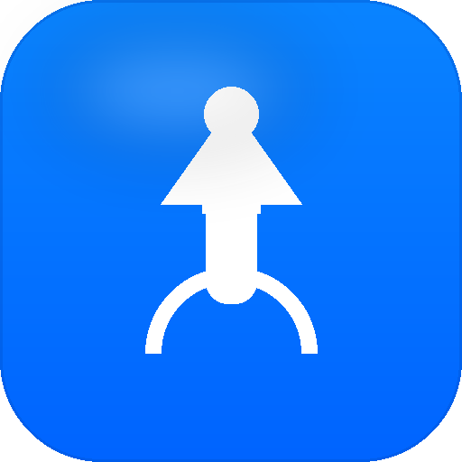

# 🚀 启动项管家

> Windows 开机启动项可视化管理桌面应用 · 苹果白高端风格

一键查看、启用、禁用、删除 Windows 开机启动项，告别任务管理器的简陋列表。支持注册表（HKCU/HKLM 的 Run/RunOnce）和启动文件夹双来源，纯本地运行，隐私优先。

## ⬇️ 直接下载

| 平台 | 下载 | 大小 |
|---|---|---|
| Windows x64 | [启动项管家 Setup 1.0.0.exe](https://github.com/grrtyre/youqu/releases/download/startup-manager-v1.0.0/Setup.1.0.0.exe) | ~73 MB |

> 下载后双击安装即可使用，无需任何依赖。

## ✨ 功能特性

- **可视化列表** —— 卡片式展示所有启动项，名称/命令/来源一目了然
- **一键切换** —— iOS 风格开关，启用/禁用 StartupApproved 状态（任务管理器同款机制）
- **四类来源** —— HKCU Run、HKLM Run、HKCU/HKLM RunOnce、启动文件夹
- **搜索筛选** —— 按名称、命令、来源关键字搜索；按启用/禁用状态筛选
- **统计概览** —— 总数、已启用、已禁用、来源数四宫格统计
- **新增启动项** —— 可视化表单写入 HKCU Run，无需手敲 reg 命令
- **打开文件位置** —— 一键在资源管理器中定位启动项可执行文件
- **安全删除** —— 二次确认弹窗，防误删
- **苹果白风格** —— 参考 macOS/iOS 原生设计，细腻阴影、圆角卡片、系统字体

## 🖼️ 截图



## 📦 技术栈

- **Electron 28** —— 跨平台桌面框架
- **原生 JS** —— 无前端框架依赖，轻量高效
- **PowerShell** —— 注册表读取（UTF-8 编码，解决中文乱码）
- **electron-builder** —— NSIS 安装包打包

## 🔧 使用方式

### 方式一：直接下载安装（推荐）

1. 下载上表的 `启动项管家 Setup 1.0.0.exe`
2. 双击运行安装程序
3. 安装完成后从开始菜单启动

### 方式二：源码运行

```bash
# 安装依赖
npm install

# 开发模式运行
npm start

# 运行核心逻辑测试
npm test

# 打包成 exe
npm run pack
```

## 📁 项目结构

```
startup-manager/
├── src/
│   ├── main.js              # Electron 主进程（注册表读取 + IPC）
│   ├── preload.js           # 上下文隔离桥接
│   ├── core/
│   │   └── startup-core.js  # 核心纯函数（解析、合并、统计）
│   └── renderer/
│       ├── index.html       # 页面结构
│       ├── styles.css       # 苹果白风格样式
│       └── renderer.js      # 渲染逻辑
├── test/
│   └── test.js              # 28 项核心逻辑测试
├── build/
│   ├── icon.ico             # 应用图标
│   └── shot-bg.ps1          # 后台截图脚本
└── package.json
```

## 🧪 测试

核心逻辑（注册表解析、状态合并、统计计算、输入校验等）有 28 项自动化测试覆盖：

```bash
npm test
```

## ⚠️ 注意事项

- 禁用 HKLM（所有用户）的启动项需要管理员权限
- 删除操作不可撤销，请确认后再执行
- 应用仅读取注册表和启动文件夹，不修改系统其他配置

## ☕ 支持我们

如果这个工具帮到了你，欢迎在爱发电请我们喝杯咖啡：

👉 [https://www.ifdian.net/a/giquwei](https://www.ifdian.net/a/giquwei)

你的支持是我们持续做下去的动力。

## 🙏 鸣谢

感谢以下朋友的支持（按支持时间排序）：

<!-- 鸣谢名单占位：有了支持者后在这里添加，格式：- [@用户名](主页链接) -->

_暂无，期待第一个支持者的出现。_

## 📄 License

[MIT License](./LICENSE)
