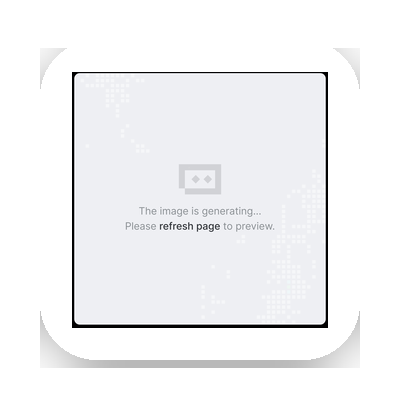
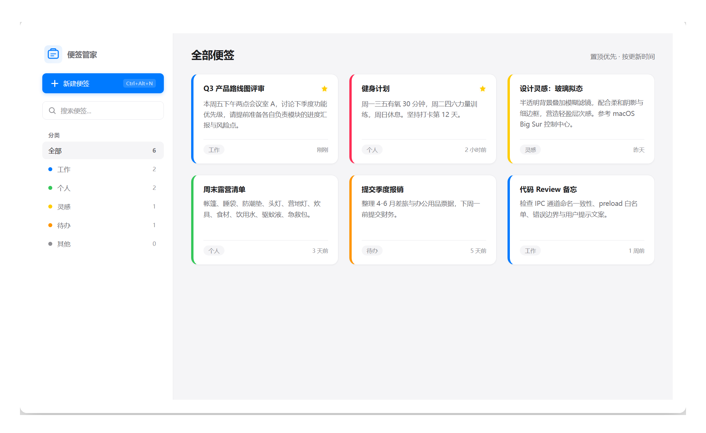
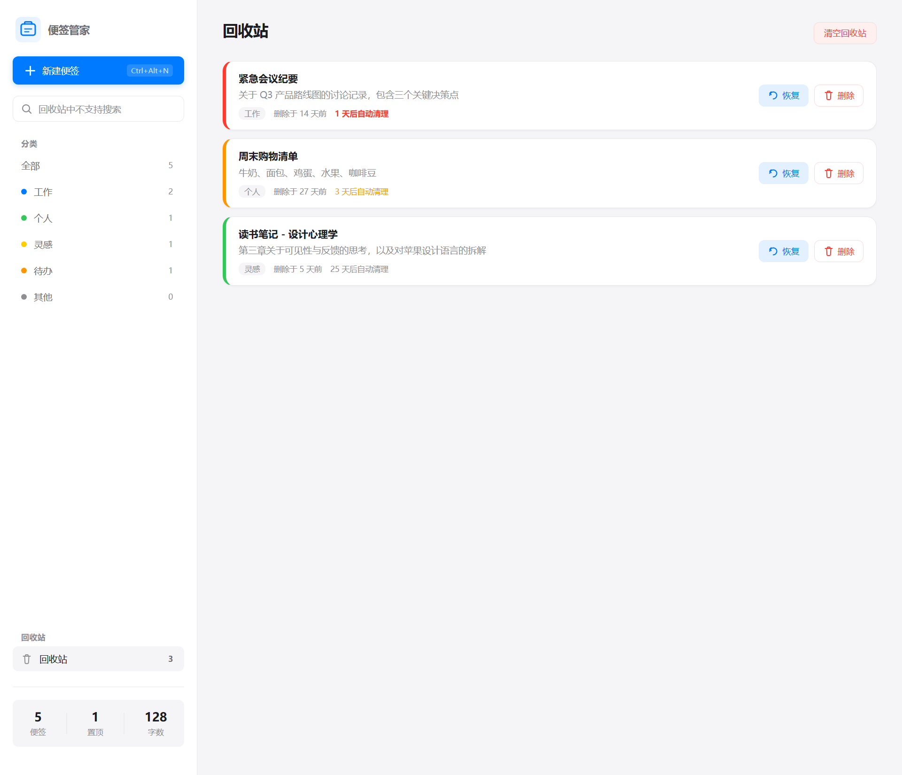

<div align="center">



<br>

# 📝 便签管家 · sticky-notes-manager

> 苹果白高端风格的本地便签桌面应用：快速记录、分类管理、置顶标记、全文搜索、颜色标签、导入导出，纯本地隐私优先。

<br>


<br>

一款轻量级桌面便签工具，灵感来自 macOS 便签 + Apple Notes 的设计语言。所有数据存储在本地，不联网、不上传、不登录，打开即用。

| 📊 便签数 | 📌 置顶标记 | 🎨 颜色标签 | 🗑️ 回收站 | 🧪 测试用例 |
|:---:|:---:|:---:|:---:|:---:|
| 无限 | 重要置顶 | 7 种色彩 | 30 天恢复 | 129 个全通过 |

</div>

---

## ⬇️ 直接下载

| 版本 | 下载链接 | 说明 |
|:---:|---|---|
| 🪟 安装版（推荐） | [便签管家 Setup 1.1.0.exe](https://github.com/grrtyre/youqu/releases/download/sticky-notes-manager-v1.1.0/sticky-notes-manager-Setup-1.1.0.exe) | 双击安装，自动创建桌面快捷方式 |
| 📦 免安装便携版 | [便签管家 1.1.0.exe](https://github.com/grrtyre/youqu/releases/download/sticky-notes-manager-v1.1.0/sticky-notes-manager-1.1.0.exe) | 双击即用，不写注册表 |

> 系统要求：Windows 10/11 x64 ｜ 🔒 所有数据本地存储，绝不联网上传

## 🖼️ 界面预览

<table>
  <tr>
    <td width="50%" align="center">
      
      <br><sub><b>便签主视图</b></sub><br>
      <sub>分类筛选 · 颜色标签 · 置顶标记 · 全文搜索</sub>
    </td>
    <td width="50%" align="center">
      
      <br><sub><b>回收站视图</b></sub><br>
      <sub>一键恢复 · 过期警告 · 30 天自动清理</sub>
    </td>
  </tr>
</table>

## ✨ 功能特性

- **⚡ 快速记录** —— 全局快捷键 `Ctrl+Alt+N` 随时唤起新建便签，不打断思路
- **🗂️ 分类管理** —— 工作 / 个人 / 灵感 / 待办 / 其他 五大分类，侧边栏一键筛选
- **📌 置顶标记** —— 右键卡片快速置顶，重要内容永远排在最前
- **🔍 全文搜索** —— 标题 + 内容实时搜索，毫秒级响应
- **🎨 颜色标签** —— 7 种颜色标记便签，左侧色条直观区分
- **↕️ 排序策略** —— 置顶优先 → 按更新时间倒序，自动排列
- **🗑️ 回收站** —— 删除的便签移入回收站而非永久丢失，可一键恢复或彻底删除，30 天后自动清理，告别误删焦虑
- **📤 导入导出** —— JSON 格式导入导出，数据可迁移不锁定
- **📊 统计概览** —— 便签数 / 置顶数 / 总字数 一目了然
- **💠 托盘常驻** —— 关闭窗口后台常驻，快捷键随时唤起
- **🔒 纯本地隐私** —— 所有数据存在本地 JSON 文件，绝不联网

## 🚀 快速开始

### 安装版
下载上方的 `便签管家 Setup 1.1.0.exe`，双击安装即可。

### 开发模式
```bash
npm install
npm start
```

### 打包
```bash
npm run build
```
生成的安装包在 `dist/` 目录：
- `便签管家 Setup 1.1.0.exe` —— NSIS 安装包
- `便签管家 1.1.0.exe` —— 免安装便携版

## ⌨️ 快捷键

| 快捷键 | 功能 | 作用域 |
|:---:|---|---|
| `Ctrl + Alt + N` | 新建便签 | 全局 |
| `Ctrl + Alt + S` | 唤起主窗口 | 全局 |
| `Ctrl + Enter` | 保存便签 | 编辑弹窗内 |
| `Esc` | 关闭编辑弹窗 | 编辑弹窗内 |
| `右键卡片` | 切换置顶状态 | 便签列表 |

## 📁 项目结构

```
sticky-notes-manager/
├── src/
│   ├── main.js              # Electron 主进程（窗口、托盘、全局快捷键）
│   ├── preload.js           # 预加载脚本（contextBridge 安全通信）
│   ├── core/
│   │   └── note-store.js    # 核心存储逻辑（CRUD + 搜索 + 排序 + 统计 + 回收站）
│   └── renderer/
│       ├── index.html       # 页面结构
│       ├── styles.css       # 苹果白高端风格样式
│       └── renderer.js      # 渲染层逻辑
├── test/
│   └── test.js              # 核心逻辑测试（129 个用例）
├── build/
│   ├── icon.ico             # 应用图标
│   ├── make_icon.py         # 图标生成脚本
│   ├── gen-demo-data.js     # 演示数据生成
│   └── screenshot.ps1       # 后台截图脚本
├── assets/                  # README 展示资源（Logo + 截图）
├── .gitignore
├── LICENSE
└── README.md
```

## 🛠️ 技术栈

| 技术 | 说明 |
|---|---|
| Electron 33 | 桌面应用框架 |
| 原生 JavaScript | 零运行时依赖 |
| contextBridge + ipcRenderer | 安全 IPC 通信 |
| electron-builder | NSIS 安装包打包 |
| 苹果白高端风格 | 参考 macOS / iOS 原生设计 |

## 🧪 测试

```bash
node test/test.js
```

129 个用例覆盖：ID 生成、创建便签、读写存储、新增 / 更新 / 删除便签、切换置顶、搜索便签、分类筛选、排序逻辑、统计计算、导入导出、常量定义、默认路径、回收站全流程。

> v1.1.0 新增 43 个回收站相关用例：回收站便签对象、移入回收站、恢复便签、彻底删除 / 清空、自动清理过期、剩余天数计算、v2 数据格式读写、v1 旧数据向后兼容、saveNotes 保留回收站。

## 🎨 设计理念

- **苹果白风格** —— 白色 / 浅灰背景、细腻多层阴影、系统字体（-apple-system, PingFang SC）、蓝色 `#007aff` 强调
- **隐私第一** —— 所有数据本地存储，绝不联网上传
- **极简极速** —— 打开即用，毫秒级响应
- **桌面原生感** —— 托盘常驻 + 全局快捷键，真正的桌面工具体验

## 📝 更新日志

### v1.1.0 补充修复（2026-07-15 UX 巡检）
- 🔒 **破坏性操作二次确认**：清空回收站、彻底删除单条均增加二次确认弹窗，防误操作永久丢失
- 💾 **未保存内容防丢失**：编辑弹窗关闭时若存在未保存内容，提示确认，避免误关丢失输入
- 🐛 **修复 Toast 文案**：更新已有便签时不再错误提示「已创建」，改为「已保存」
- 🔍 **修复搜索状态不一致**：进入回收站后返回便签视图，搜索框与列表过滤状态不再错位
- ⏰ **回收站过期分级警告**：剩余 ≤1 天红色、≤3 天橙色高亮，临近过期更醒目
- ⌨️ **标题支持 Ctrl+Enter 保存**：与正文快捷键统一
- 🎨 **回收站删除按钮统一**：由纯图标改为图标+文字，与「恢复」按钮风格一致
- ♿ **可访问性增强**：Toast 增加 aria-live、图标按钮补充 aria-label
- 📝 **修正 README**：安装版本号 1.0.0→1.1.0、测试用例数 86→129

### v1.1.0（2026-07-12）
- 🗑 **新增回收站功能**：删除的便签移入回收站而非永久丢失，可一键恢复或彻底删除，30 天后自动清理
- 🐛 **修复下载链接**：README 下载链接文件名缺少项目名前缀，已修正
- 🔄 **数据格式升级**：v2 格式增加 trash 字段，完全向后兼容 v1 旧数据（自动识别）
- 🧪 **单元测试增至 129 个**：新增回收站全流程测试（移入/恢复/彻底删除/清空/自动清理/剩余天数/数据格式兼容）

### v1.0.0
- 首次发布：快速记录、分类管理、置顶标记、全文搜索、颜色标签、导入导出、统计概览、托盘常驻

## ☕ 支持我们

如果这个工具帮到了你，欢迎在爱发电请我们喝杯咖啡：

👉 [https://www.ifdian.net/a/giquwei](https://www.ifdian.net/a/giquwei)

## 🙏 鸣谢

感谢以下朋友的支持（按支持时间排序）：

<!-- 鸣谢名单占位：有了支持者后在这里添加，格式：- [@用户名](主页链接) -->

_暂无，期待第一个支持者的出现。_

## 📄 License

MIT
