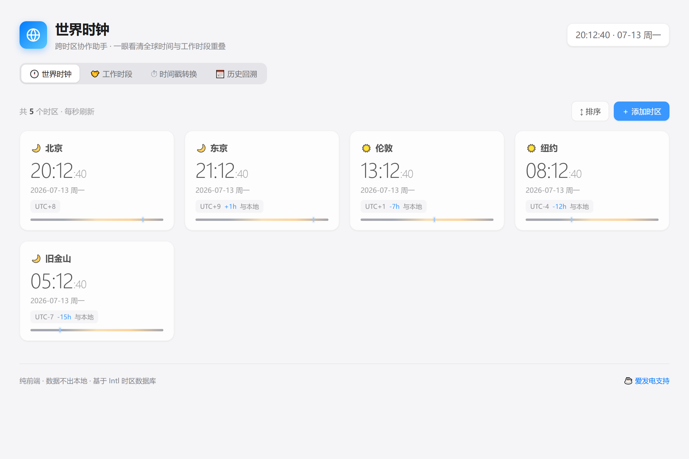

<div align="center">

# 🌐 世界时钟 · 跨时区协作助手

**一眼看清全球时间与工作时段重叠 · 远程协作时代的跨时区瑞士军刀**

<p>
  <a href="./LICENSE"></a>
  
  
  
  
  
</p>



</div>

> 🍎&nbsp;苹果白高端风格 · 纯前端 · 数据不出本地 · 自动处理夏令时

---

## ✨ 功能特性

| 模块 | 能力 |
|---|---|
| 🕐 **世界时钟** | 多时区并排对比，每秒刷新；显示城市、当前时间、日期、UTC 偏移、与本地时差、昼夜状态；可按时间排序 |
| 🔍 **时间预览滑块** | 拖动查看 ±12 小时内各时区的未来/过去时间，会议规划利器 |
| 🤝 **工作时段重叠** | 可视化 24 小时时间轴，标注每个时区的工作时段（默认 9:00-18:00），自动高亮"全员可开会"的重叠窗口 |
| ✨ **智能会议推荐** | 按"黄金时段 + 时长"打分排序，给出最佳会议时间、各参与人本地时间与便利度标签（极佳/较好/勉强），一键复制会议信息 |
| ⏱ **时间戳转换** | 输入 Unix 时间戳（秒/毫秒自动识别）或 ISO 字符串，一键查看各时区对应日期、时间、星期，可复制 |
| 📅 **历史回溯** | 选择任意时刻，查看各时区对应时间（自动处理夏令时 DST），适合会议回溯、跨时区事件复盘 |

## 🎯 解决什么痛点

- 远程办公常态化，跨时区沟通最频繁的痛点：**"现在他们几点？""什么时候能开会？"**
- 市面工具要么太简陋（只有世界地图），要么太重（企业级日历）
- 本工具的精准卖点：**"工作时段重叠可视化"** —— 一眼看出全员都能开会的时间窗
- 填补 youqu 工具集时区相关空白

## 🚀 快速开始

### 方式一：直接打开（推荐）

下载本项目，双击 `index.html`，在任意现代浏览器中打开即可使用。

### 方式二：本地起服务

```bash
# 在 world-clock 目录下
python -m http.server 8080
# 浏览器访问 http://localhost:8080
```

### 方式三：源码克隆

```bash
git clone https://github.com/grrtyre/youqu.git
cd youqu/world-clock
# 双击 index.html 或起本地服务
```

## ⌨️ 快捷键 / 交互

| 操作 | 说明 |
|---|---|
| 点击右上「＋ 添加时区」 | 搜索全球 40+ 城市并添加 |
| 鼠标悬停时区卡片 | 显示移除按钮 |
| 拖动「时间预览滑块」 | 查看 ±12 小时内各时区时间变化，方便规划会议 |
| 工作时段起止输入 | 自定义工作小时范围 |
| 点击「推荐会议时间」卡片 | 一键复制会议信息（含各参与人本地时间） |
| 时间戳 / 历史结果行 | 一键复制对应时间 |
| `Esc` | 关闭弹层 |

## 🛠 技术栈

| 类别 | 实现 |
|---|---|
| 前端 | 纯 HTML / CSS / JavaScript（零构建、零依赖） |
| 时区 | 浏览器原生 `Intl.DateTimeFormat` API（自动 DST，IANA 时区数据库） |
| 持久化 | `localStorage` 本地保存（时区选择和工作时段不丢失） |
| 隐私 | 数据完全在本地，不上传任何服务器 |

## 🎨 设计语言

- **风格** —— 苹果白高端风格，参考 macOS / iOS 原生设计
- **背景** —— 浅灰 `#f5f5f7` + 白色卡片
- **强调色** —— Apple Blue `#007aff`
- **字体** —— 系统字体栈（SF Pro / PingFang SC / Microsoft YaHei）
- **阴影** —— 细腻柔和，圆润克制
- **响应式** —— 手机 / 平板 / 桌面均可
- **无障碍** —— 尊重 `prefers-reduced-motion`

## 🧪 测试

核心逻辑有 **39 项自动化测试** 覆盖：

```bash
node test/test.js
```

覆盖范围：时区偏移（含 DST）、格式化、工作时段转 UTC、多时区重叠计算、**智能会议推荐打分排序**、时间戳转换、ISO 解析、本地输入解析等。

## 📂 项目结构

```
world-clock/
├── index.html          # 页面结构
├── styles.css          # 苹果白样式
├── app.js              # UI 逻辑
├── timezone-core.js    # 时区核心逻辑（纯函数，可测试）
├── test/
│   └── test.js         # 核心逻辑测试（39 项）
├── docs/
│   └── preview.png     # README 预览图
├── README.md
├── LICENSE
└── .gitignore
```

## 📜 更新日志

### v1.0.0

- 首次发布
- 多时区世界时钟 + 每秒刷新
- 工作时段重叠可视化 + 智能会议时间推荐
- 时间戳 / ISO 字符串解析与转换
- 历史回溯 + 夏令时自动处理
- 时间预览滑块（±12 小时）
- 苹果白高端风格 UI，响应式 + 无障碍

## ☕ 支持我们

如果这个工具帮到了你，欢迎在爱发电请我们喝杯咖啡：

👉 [https://www.ifdian.net/a/giquwei](https://www.ifdian.net/a/giquwei)

你的支持是我们持续做下去的动力。

## 🙏 鸣谢

感谢以下朋友的支持（按支持时间排序）：

<!-- 鸣谢名单占位：有了支持者后在这里添加，格式：- [@用户名](主页链接) -->

_暂无，期待第一个支持者的出现。_

## 📄 License

[MIT](./LICENSE) © 2026 youqu
